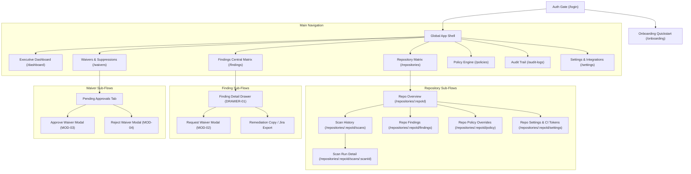
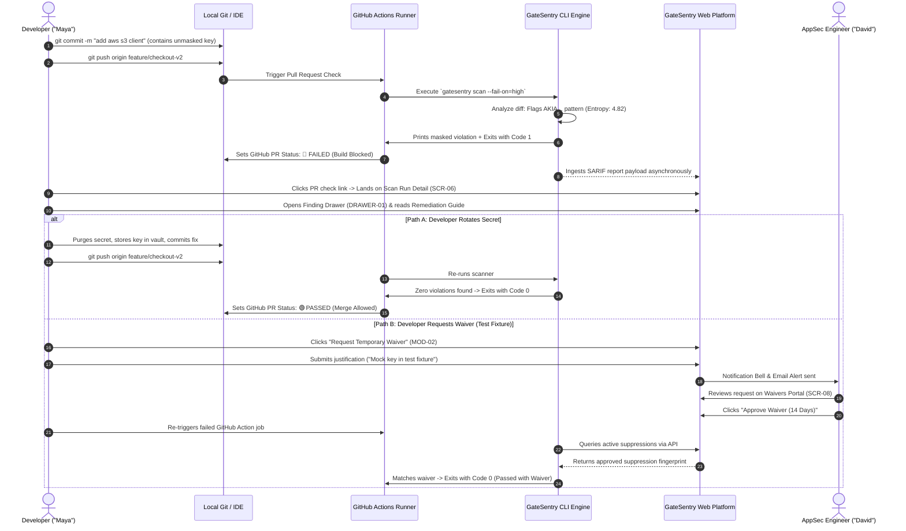

# GateSentry UX Architecture & Complete Application Flow Specification
**Product:** GateSentry — CI/CD Security Scanner & Enterprise Policy Enforcement Platform  
**Document Type:** UX & Frontend Interaction Specification (App Flow Document)  
**Version:** 1.0.0  
**Target Audience:** Frontend Engineers, Full-Stack Developers, AI Coding Agents, Product Designers, QA Engineers  
**Complementary Documents:** [PRD.md](file:///d:/CICD%20Scanner/PRD.md) | [TRD.md](file:///d:/CICD%20Scanner/TRD.md)

---

## 1. Executive UX Strategy & Design System Foundations

### 1.1 UX Mission & Design Principles
GateSentry bridges the gap between developer velocity and security policy enforcement. The design philosophy adheres to four foundational pillars:
1. **Developer-First Ergonomics:** Minimize cognitive friction. Security feedback must be instant, actionable, transparent, and educational rather than punitive.
2. **Zero-Guesswork Clarity:** Every flagged security finding must present the exact root cause, masked evidence snippet, CVSS impact, and deterministic remediation command.
3. **State Transparency:** Clear distinctions between Pass (`exit 0`), Policy Failure (`exit 1`), and Runtime/System Error (`exit 2`), complete with visual breadcrumbs and unambiguous next steps.
4. **Resilient & Accessible Feedback:** Every interactive element has defined loading skeletons, inline error boundaries, empty states with high-intent CTAs, and keyboard navigation support (`Cmd+K` global command palette, accessible ARIA roles).

### 1.2 User Roles & Access Control Matrix (RBAC)

| Role | Target Persona | Permissions & Scope | Navigation Access |
| :--- | :--- | :--- | :--- |
| **Super Admin** | Platform Director / VP SecOps | Full administrative rights: manage billing, global SSO, add/delete organizations, revoke CI runner tokens, view audit logs. | All screens & settings. |
| **AppSec Engineer** | "David" (Security Architect) | Author & publish security policies, evaluate CVSS thresholds, approve/reject suppression waivers, view full audit logs. | Dashboard, Repos, Findings, Policies, Waivers, Audit Logs. |
| **DevOps Engineer** | "Alex" (Platform Automation) | Connect repositories, generate/rotate CI runner tokens, configure repository-level overrides, view pipeline health. | Dashboard, Repos, Findings, Integrations, Waivers (request only). |
| **Developer** | "Maya" (Software Engineer) | View scan results on assigned repositories, view finding details & remediation guides, submit waiver requests. | Dashboard, Repos (read-only), Findings, Waivers (view & submit request). |

---

## 2. Global Information Architecture & Sitemap



---

## 3. Global App Shell & Common UI Components

### 3.1 Global Topbar (`LAYOUT-TOPBAR`)
- **Position:** Fixed top, `h-16`, z-index 40, border-b border-border/40, backdrop-blur-md bg-background/80.
- **Components (Left to Right):**
  1. **Mobile Menu Hamburger:** (`lg:hidden`) Toggles Left Sidebar.
  2. **Brand Emblem & Wordmark:** GateSentry logo icon + "GateSentry" font-bold text. Clicking navigates to `/dashboard`.
  3. **Organization Selector Dropdown:**
     - Displays active org name (e.g., `Acme Corp [Enterprise]`) with chevron icon.
     - *Click:* Opens dropdown listing all user-member orgs + "+ Create New Organization" button.
     - *Selection:* Reloads tenant context, resets router cache, redirects to `/dashboard`.
  4. **Global Command Search (`Cmd+K` / `Ctrl+K`):**
     - Button input trigger displaying: `"Search repos, CVEs, or findings... ⌘K"`.
     - *Click / Keydown:* Opens `MOD-SEARCH` command palette with fuzzy search across Repositories, Rule IDs (e.g., `GATESENTRY-SEC-001`), CVEs (e.g., `CVE-2021-3749`), and Settings.
  5. **Live Scanner Activity Indicator:** Subtle pulsing badge displaying runner queue state (e.g., `🟢 3 Scans Running`).
  6. **Documentation Link Icon:** Opens GateSentry CLI docs & ruleset dictionary in new tab (`target="_blank"`).
  7. **Notification Center Popover (Bell Icon):**
     - Displays red badge counter when unread items exist (e.g., `3`).
     - Items: New waiver submitted for review, scan failed on default branch `main`, token expiring in $<7$ days.
     - Actions inside popover: "Mark all as read", click item to navigate directly to finding/waiver.
  8. **User Profile Dropdown:**
     - Displays user avatar, name, and role badge (`AppSec Admin`).
     - Options: Profile Settings, API Keys, Keyboard Shortcuts, Dark/Light Mode toggle, "Sign Out" button.

### 3.2 Global Left Sidebar (`LAYOUT-SIDEBAR`)
- **Position:** Fixed left, `w-64`, top-16, h-[calc(100vh-4rem)], border-r border-border/40, bg-card/50. Collapsible to `w-20` on icon-only mode.
- **Navigation Items:**
  - `Dashboard` (Icon: `LayoutDashboard`, Path: `/dashboard`)
  - `Repositories` (Icon: `GitFork`, Path: `/repositories`, Badge: Total Active Repos count)
  - `Findings & Vulnerabilities` (Icon: `ShieldAlert`, Path: `/findings`, Badge: High/Crit count in red)
  - `Waivers & Suppressions` (Icon: `FileCheck2`, Path: `/waivers`, Badge: Pending Approval count in amber)
  - `Policy Engine` (Icon: `SlidersHorizontal`, Path: `/policies`)
  - `Audit Trail` (Icon: `History`, Path: `/audit-logs`)
  - `Settings & Integrations` (Icon: `Settings`, Path: `/settings`)
- **Footer Section:**
  - CLI Version Pill: `CLI Engine v1.0.0` (Click checks for binary releases).
  - Quick Copy: `gatesentry scan` copy-to-clipboard button with tooltip.

---

## 4. Screen-by-Screen UX & State Specifications

---

### Screen SCR-01: Authentication & Identity Gate (`/login`)
- **Route:** `/login`
- **Access:** Public / Unauthenticated visitors.
- **Purpose:** Secure enterprise sign-in via OAuth 2.0 / OIDC identity providers or corporate SAML SSO.

```
┌─────────────────────────────────────────────────────────────┐
│                    GateSentry Security                      │
│            Continuous CI/CD Policy Enforcement Engine       │
│                                                             │
│  ┌───────────────────────────────────────────────────────┐  │
│  │ [ GitHub Icon ]  Continue with GitHub                 │  │
│  │ [ GitLab Icon ]  Continue with GitLab                 │  │
│  │ [ Google Icon ]  Continue with Google Workspace       │  │
│  └───────────────────────────────────────────────────────┘  │
│                             ── OR ──                        │
│  ┌───────────────────────────────────────────────────────┐  │
│  │ Single Sign-On (SAML / Okta)                          │  │
│  │ [ Enter work email: user@company.com                ] │  │
│  │ [ Continue with Enterprise SSO                      ] │  │
│  └───────────────────────────────────────────────────────┘  │
│                                                             │
│  Terms of Service  •  Privacy Policy  •  Zero-Code-Storage  │
└─────────────────────────────────────────────────────────────┘
```

#### Interactive Elements & Button Behaviors
1. **"Continue with GitHub" Button:**
   - *Variant:* Primary Dark (`bg-zinc-900 text-white`).
   - *Behavior on Click:* Initiates OAuth flow to `https://github.com/login/oauth/authorize?client_id=...&scope=read:user,repo:status`.
   - *Loading State:* Button disabled, label changes to `"Connecting to GitHub..."` with spinner.
2. **"Continue with GitLab" Button:**
   - *Variant:* Secondary (`border border-zinc-300`).
   - *Behavior on Click:* Redirects to GitLab OAuth endpoint.
3. **"Continue with Google Workspace" Button:**
   - *Variant:* Secondary with Google G icon.
   - *Behavior on Click:* Initiates Google OAuth redirect.
4. **"Work Email" Input Field:**
   - *Type:* `email`, placeholder `"name@company.com"`.
   - *Validation:* RFC 5322 regex. Displays red error text if invalid: `"Please enter a valid work email address."`
5. **"Continue with Enterprise SSO" Button:**
   - *Trigger:* Submits email domain to identify Identity Provider (IdP).
   - *Behavior on Click:* Queries `GET /api/v1/auth/sso/lookup?domain=company.com`. If configured, redirects to Okta/Azure AD login URL.

#### Navigation Paths
- **Incoming:** Direct browser entry, redirect from protected routes (`/dashboard`, `/repositories`, etc.) with `?redirect=/target/path`.
- **Outgoing:**
  - On first-time sign-up: Redirects to `/onboarding`.
  - On existing user login: Redirects to `/dashboard` (or cached `?redirect=` target).

#### State Variations
- **Success State:** Instant redirection with secure HTTP-only session cookie (`gs_sess_token`) and JWT claims.
- **Error States:**
  - `AUTH_PROVIDER_REJECTED`: Alert banner: `"GitHub authorization was cancelled. Please try again."`
  - `SSO_DOMAIN_UNCONFIGURED`: Inline error: `"No SAML provider configured for this domain. Contact your security admin."`
  - `RATE_LIMITED`: Red banner: `"Too many login attempts. Please wait 60 seconds."`
- **Empty State:** Clean pristine form ready for interaction.

---

### Screen SCR-02: Guided Onboarding & Quickstart Wizard (`/onboarding`)
- **Route:** `/onboarding`
- **Access:** Authenticated users belonging to an organization with zero configured repositories.
- **Purpose:** Onboard the engineering organization in 4 friction-free steps within 3 minutes.

#### Stepper Architecture
- **Step 1: Organization Profile** (Name, Slug, Primary Git Ecosystem).
- **Step 2: Repository Connection** (GitHub App installation or manual PAT).
- **Step 3: Generate CI Runner Token** (`gs_live_...` with 1-click copy).
- **Step 4: Pipeline Integration Snippet** (Interactive YAML generator for GitHub Actions, GitLab CI, or pre-commit hook).

#### Interactive Elements & Button Behaviors
1. **"Install GitHub App" Button (Step 2):**
   - *Action:* Launches popup window for GitHub App installation on target organization/repos.
   - *Polling State:* Web app polls `GET /api/v1/repos/sync-status` every 2 seconds until installation confirmation is received.
2. **"Generate CI Token" Button (Step 3):**
   - *Action:* Calls `POST /api/v1/tokens/generate`.
   - *Display:* Displays token once in masked box: `gs_live_a89f...32d1` with `"Copy Secret"` button.
   - *Security Warning Banner:* `[CAUTION] This token will never be shown again. Add it to your repository secrets as GATESENTRY_TOKEN.`
3. **CI Pipeline Selector Tabs (Step 4):**
   - Options: `GitHub Actions`, `GitLab CI`, `Bitbucket Pipelines`, `Local Pre-Commit Hook`.
   - Clicking a tab updates the code preview snippet instantly.
4. **"Verify First Scan" Button:**
   - *Action:* Listens via WebSocket to `/api/v1/scans/live-feed` waiting for the first incoming scan event.
   - *Visual Feedback:* Radar pulse animation with text `"Listening for incoming CI/CD scan payload..."`.
   - *On First Scan Received:* Transitions to green checkmark with soundless burst animation, enabling `"Go to Dashboard"` button.

#### Navigation Paths
- **Incoming:** New user signup redirect.
- **Outgoing:** Clicking `"Go to Dashboard"` moves user to `/dashboard`. Can click `"Skip to Dashboard"` anytime to configure later.

#### State Variations
- **Success State:** Successful test payload triggers green banner: `"First scan verified! 0 secrets leaked, 1 high CVE detected. Pipeline gate tested successfully."`
- **Error State:** Token generation failure displays retry modal with descriptive error code (`ERR_TOKEN_DB_TIMEOUT`).
- **Empty State:** No repositories detected in Git organization prompt: `"No repositories found in connected GitHub org. Check your GitHub App permissions."`

---

### Screen SCR-03: Executive Security Posture Dashboard (`/dashboard`)
- **Route:** `/dashboard`
- **Access:** All authenticated users (Super Admin, AppSec, DevOps, Developer).
- **Purpose:** High-level executive overview of the organization’s DevSecOps security posture, live pipeline build failures, and active risk breakdown.

```
┌────────────────────────────────────────────────────────────────────────────────────────┐
│  Executive Security Posture                                  [ 7 Days ▼ ] [ Export CSV]│
├───────────────────┬───────────────────┬───────────────────┬────────────────────────────┤
│ Active Repos      │ Scans Evaluated   │ Critical / High   │ Policy Pass Rate           │
│ 48                │ 1,249 (+12%)      │ 7 Findings (-3)   │ 96.4%                      │
│ [🟢 45 Pass | 🔴 3]│ [P95 Scan: 14.2s] │ [2 Secrets | 5 CVE│ [42 Builds Blocked]        │
├───────────────────┴───────────────────┴───────────────────┴────────────────────────────┤
│  Vulnerability & Secret Exposure Trend (30 Days)           Top Threat Categories       │
│  [ Interactive Multi-Area Chart: Secrets vs CVEs ]          [ Bar: AWS Key (60%)     ]  │
│                                                            [ Bar: Lodash RCE (25%)  ]  │
│                                                            [ Bar: AGPL License (15%)]  │
├────────────────────────────────────────────────────────────────────────────────────────┤
│  Live Pipeline Scan Activity                                                           │
│  Status   Repository          Branch          Commit    Duration  Violations  Time     │
│  🔴 FAILED  payment-service    feature/stripe  8a1f3c    12.4s     1 Secret    2m ago   │
│  🟢 PASSED  auth-core          main            c4d90e    8.1s      0           8m ago   │
│  🔴 FAILED  analytics-worker   bugfix/query    f1b209    18.7s     2 High CVEs 14m ago  │
└────────────────────────────────────────────────────────────────────────────────────────┘
```

#### UI Components & Interactive Elements
1. **Time Window Dropdown Filter:**
   - Options: `Last 24 Hours`, `Last 7 Days` (Default), `Last 30 Days`, `Last 90 Days`.
   - *Behavior:* Changes query param `?range=7d` and triggers background refetch of charts via TanStack Query without page refresh.
2. **Four Top Metric KPI Cards:**
   - **Card 1: Active Repositories:** Displays count with breakdown badge (`45 Passing / 3 Failing`). Clicking navigates to `/repositories?filter=failing`.
   - **Card 2: Scans Evaluated:** Total CI runs executed. Includes P95 latency subtext (`14.2s`).
   - **Card 3: Critical & High Findings:** Color-coded in red. Clicking navigates to `/findings?severity=CRITICAL,HIGH`.
   - **Card 4: Policy Pass Rate:** Gauge indicator (`96.4%`) with subtext `"42 builds blocked by GateSentry"`.
3. **Trend Chart (Recharts Multi-Area):**
   - Visualizes daily counts of Detected Secrets vs CVEs vs Suppressed Findings.
   - Hovering points displays tooltip with exact counts and dates.
4. **Live Pipeline Activity Table:**
   - Shows last 10 scan runs streamed in real time via Server-Sent Events (SSE).
   - Columns: `Status Badge` (Passed/Failed/Error), `Repository Name`, `Branch`, `Commit SHA` (linked to GitHub commit), `Duration`, `Violations Count`, `Timestamp`.
   - Clicking any row navigates directly to `SCR-06: Single Scan Run Detail Page`.

#### State Variations
- **Success State:** Clean charts, updated live activity timestamps (`"Just now"`, `"2m ago"`).
- **Error State (API Ingestion Outage):** Toast banner: `"Unable to fetch telemetry metrics. Displaying cached data from 10 minutes ago."` with `"Retry"` button.
- **Empty State (New Account):** KPI cards show `0`, chart displays placeholder dotted guide with CTA: `"[Connect Your First Repository]"`.

---

### Screen SCR-04: Repository Matrix & Fleet Overview (`/repositories`)
- **Route:** `/repositories`
- **Access:** All authenticated users.
- **Purpose:** Searchable, filterable directory of all git repositories registered under the organization, displaying security health and CI status.

#### UI Controls & Table Grid
1. **Search Input Field:**
   - Free-text search matching repository name or slug with 250ms debounce.
2. **Filter Dropdowns:**
   - **Provider Filter:** `All Providers`, `GitHub`, `GitLab`, `Bitbucket`.
   - **Health Status Filter:** `All`, `Passing (exit 0)`, `Blocked / Failing (exit 1)`, `Unscanned`.
   - **Ecosystem Filter:** `Node.js`, `Python`, `Go`, `Multi-Language`.
3. **"Connect Repository" Button (`BTN-ADD-REPO`):**
   - *Variant:* Primary (`bg-primary text-white`).
   - *Behavior on Click:* Opens `MOD-01: Connect Repository Modal`.
4. **Repository Table Row Elements:**
   - **Repository Name & Provider Icon:** E.g., `github / acme / checkout-api`.
   - **Default Branch Status:** Badge `main: 🟢 PASSING` or `main: 🔴 2 CRITICAL`.
   - **Last Scan Summary:** Timestamp + Commit SHA (`8a1f3c2`) + Trigger author.
   - **Active Findings Counters:** Pill indicators: Red for Critical, Orange for High, Yellow for Medium.
   - **Actions Context Menu (`...`):**
     - "View Scan History" (Navigates to `/repositories/:id/scans`).
     - "Configure Repository Policy" (Navigates to `/repositories/:id/policy`).
     - "Copy CI Environment Token".
     - "Trigger On-Demand Re-scan".

#### Navigation Paths
- **Incoming:** Sidebar click on `Repositories`, or clicking KPI card on Dashboard.
- **Outgoing:** Clicking repository row navigates to `SCR-05: Repository Overview`.

#### State Variations
- **Success State:** Paginated table (25 repos per page) with responsive sortable columns.
- **Error State:** In case of backend failure, displays empty table with: `"Failed to load repositories. [Retry Connection]"`.
- **Empty State (Filtered Out):** `"No repositories match filter 'failing' in Python ecosystem."` with `"[Clear All Filters]"` button.

---

### Screen SCR-05: Repository Details & Sub-Tabs (`/repositories/:repoId`)
- **Route:** `/repositories/:repoId`
- **Access:** All authenticated users.
- **Purpose:** Central hub for an individual repository, displaying branch postures, scan logs, active vulnerabilities, and custom policy rules.

```
┌────────────────────────────────────────────────────────────────────────────────────────┐
│  github / acme / checkout-api                               [ 🔴 BUILD FAILING ]       │
│  Default Branch: main  •  Language: TypeScript (Node.js)  •  Last Scanned: 4m ago      │
├────────────────────────────────────────────────────────────────────────────────────────┤
│  [ Overview ]  [ Scan Runs (142) ]  [ Findings (3) ]  [ Policy Overrides ]  [ Settings]│
├────────────────────────────────────────────────────────────────────────────────────────┤
│  Active Branch Health                                                                  │
│  • main: 🔴 1 Leaked Secret (AWS IAM Access Key) — Blocked commit 8a1f3c                │
│  • staging: 🟢 Passing (All policies satisfied)                                        │
│  • feature/v2-pay: 🔴 2 High Vulnerabilities (axios@0.21.1)                            │
├────────────────────────────────────────────────────────────────────────────────────────┤
│  Quick Pipeline Integration Code                                                       │
│  [ Copy GitHub Action YAML ]  [ Download .gatesentry.yml ]  [ Test Local Scan CLI ]    │
└────────────────────────────────────────────────────────────────────────────────────────┘
```

#### Sub-Tab Layout
1. **Tab 1: Overview:** Branch matrix, recent commit posture cards, quick-action CLI snippet triggers.
2. **Tab 2: Scan Runs (`/repositories/:repoId/scans`):**
   - Paginated historical log of every execution run on this repository.
   - Columns: Status badge, Branch, Commit SHA, Author, Duration, Findings (Secrets, CVEs, Licenses), Actions ("View Run SARIF", "Inspect Details").
3. **Tab 3: Findings (`/repositories/:repoId/findings`):**
   - Scoped finding matrix for this repository only.
   - Clicking opens `DRAWER-01: Finding Detail Drawer`.
4. **Tab 4: Policy Overrides (`/repositories/:repoId/policy`):**
   - Shows active inheritance: whether this repo uses Global Org Policy or repository-specific `.gatesentry.yml`.
5. **Tab 5: Settings (`/repositories/:repoId/settings`):**
   - Manage repo-scoped CI Runner tokens, webhook notification endpoints (Slack/Discord), and delete repository linkage.

---

### Screen SCR-06: Single Scan Run Detail Page (`/repositories/:repoId/scans/:scanId`)
- **Route:** `/repositories/:repoId/scans/:scanId`
- **Access:** All authenticated users.
- **Purpose:** Deep-dive diagnostic post-mortem for an individual CI execution run. Explains why a build was broken or permitted.

```
┌────────────────────────────────────────────────────────────────────────────────────────┐
│  ← Back to Scan History        Scan Execution Run #142                                 │
├────────────────────────────────────────────────────────────────────────────────────────┤
│  Exit Code: 1 (FAILED - POLICY VIOLATION)    Trigger: GitHub Actions (Pull Request #42)│
│  Branch: feature/checkout-v2                 Commit: a1b2c3d4 (Maya Lin)               │
│  Duration: 4.25 seconds                      Timestamp: 2026-09-15 21:04:12 UTC        │
├────────────────────────────────────────────────────────────────────────────────────────┤
│  Summary Findings:  🔴 1 Leaked Secret   🟠 2 High CVEs   🟢 0 License Violations       │
├────────────────────────────────────────────────────────────────────────────────────────┤
│  Detected Findings in this Run                                                         │
│                                                                                        │
│  [!] SECRET LEAK: AWS Access Key ID                                  Severity: CRITICAL│
│      File: backend/src/config/aws.ts:14                                                │
│      Masked Evidence: const AWS_KEY = "AKIA****************"                           │
│      Policy Violation: Rule 'GATESENTRY-SEC-AWS' (Shannon Entropy: 4.82)              │
│      [ View Code Context ]   [ Request Temporary Waiver ]   [ Remediation Guide ]     │
│                                                                                        │
│  [!] VULNERABILITY: CVE-2021-3749 (axios@0.21.1)                     Severity: HIGH    │
│      CVSS Score: 7.5 (High)  •  Ecosystem: npm                                         │
│      Fix Target: Upgrade to axios >= 0.21.2                                            │
│      [ Inspect Dependency Tree ]   [ Request Temporary Waiver ]                       │
├────────────────────────────────────────────────────────────────────────────────────────┤
│  [ Raw Terminal ANSI Output ]   [ Raw SARIF v2.1.0 Payload ]   [ Download JSON Report ]│
└────────────────────────────────────────────────────────────────────────────────────────┘
```

#### Interactive Elements & Button Behaviors
1. **"Download SARIF v2.1.0" Button:**
   - *Action:* Downloads immutable signed artifact from S3 bucket: `report-scan-142.sarif.json`.
2. **"Raw Terminal ANSI Output" Accordion:**
   - Expands a full dark-mode terminal emulator view rendering exact colored ANSI text produced by CLI runner.
3. **"Request Temporary Waiver" Button:**
   - Opens `MOD-02: Request Waiver Modal` with pre-filled metadata (`repoId`, `fingerprint`, `scanId`).
4. **"View Code Context" Button:**
   - Expands inline read-only Monaco Editor snippet highlighting line 14 with red gutter indicator and masked token.

#### State Variations
- **Success State (Exit Code 0):** Header displays green badge: `"PASSED - ALL POLICIES COMPLIED"`. Findings section displays clean state illustration: `"Zero security policy violations found in commit a1b2c3d4."`
- **Error State (Exit Code 2 - Scanner Crash):** Displays warning banner: `"Scanner execution halted due to configuration parse error in .gatesentry.yml: Line 18 syntax error. Build terminated safely."`
- **Empty State:** N/A (Scan run is immutable).

---

### Screen SCR-07: Central Findings & Vulnerability Matrix (`/findings`)
- **Route:** `/findings`
- **Access:** All authenticated users.
- **Purpose:** Enterprise-wide triage workstation. Allows AppSec engineers and developers to filter, inspect, and remediate every detected secret, CVE, and unapproved license across all repositories.

#### Advanced Filtering Toolbar
- **Finding Type Multi-Select:** `Secrets`, `CVE Vulnerabilities (SCA)`, `License Violations`.
- **Severity Checkboxes:** `CRITICAL` (Red), `HIGH` (Orange), `MEDIUM` (Yellow), `LOW` (Blue).
- **Status Filter:** `Active (Failing Pipelines)`, `Suppressed / Waived`, `Resolved / Purged`.
- **Repository Search Selector:** Search and filter by single or multiple repositories.
- **Bulk Actions Bar (AppSec Only):**
  - Displays when checkboxes are ticked on table rows.
  - Actions: `[ Bulk Request Waiver ]`, `[ Export to Jira / Linear ]`, `[ Export CSV ]`.

#### Finding Table Row Columns
1. **Checkbox:** Row selection for batch actions.
2. **Severity Badge:** Pill indicator with icon (`CRITICAL`, `HIGH`, `MEDIUM`, `LOW`).
3. **Finding Identification:** Rule name or CVE ID (e.g., `AWS Access Key` or `CVE-2023-45133`).
4. **Target Location:** Repository name + File path + Line number (`acme/web: lib/auth.ts:42`).
5. **Introduced By:** Author name + Commit SHA + Timestamp.
6. **Status Pill:** `ACTIVE` (Red) or `WAIVED` (Amber with expiration countdown) or `FIXED` (Green).
7. **Action Button:** `"Triage Finding →"` (Triggers `DRAWER-01`).

#### State Variations
- **Success State:** Fast virtualized table scrolling smoothly through thousands of findings.
- **Error State:** Server fetch failure displays inline reload prompt: `"Error loading findings. [Reload]"`.
- **Empty State (Zero Findings):**
  - Graphic: Sleek shield checkmark illustration.
  - Heading: `"Clean Bill of Health!"`
  - Body: `"No active policy violations detected across your active repositories. GateSentry is actively guarding your CI pipelines."`

---

### Drawer DRAWER-01: Finding Triage & Remediation Drawer
- **Trigger:** Clicking any finding row from `SCR-06`, `SCR-07`, or `SCR-05`.
- **Placement:** Slides in from the right edge, `w-[640px]`, h-screen, z-50, shadow-2xl, bg-background, border-l border-border.
- **Keyboard Shortcut:** `Escape` key closes drawer.

```
┌─────────────────────────────────────────────────────────────┐
│  [X Close]    Finding Triage                   [Copy Link ↗]│
├─────────────────────────────────────────────────────────────┤
│  AWS Access Key ID Leaked in Git Diff         [ CRITICAL ]  │
│  Rule ID: GATESENTRY-SEC-AWS  •  Status: ACTIVE (Breaking CI)│
├─────────────────────────────────────────────────────────────┤
│  Evidence Details                                           │
│  Repository: acme/payment-service                           │
│  File Path: src/integrations/aws_client.ts:24               │
│  Commit: 8f9a2b1 (feat: add s3 upload) by alex@acme.com     │
│  Fingerprint: e3b0c44298fc1c149afbf4c8996fb92427ae41e4...   │
├─────────────────────────────────────────────────────────────┤
│  Masked Code Preview                                        │
│  22 │ const s3 = new S3Client({                             │
│  23 │   region: 'us-east-1',                                │
│  24 │   accessKeyId: 'AKIA****************', // [!] FLAGGED │
│  25 │ });                                                   │
├─────────────────────────────────────────────────────────────┤
│  Remediation Playbook (Step-by-Step)                        │
│  1. Revoke the Key: Invalidate this key immediately in AWS   │
│     IAM Console to block potential unauthorized access.      │
│  2. Purge Git History: If committed, run git-filter-repo    │
│     to rewrite commits and remove key from history.         │
│  3. Inject via Environment: Store secret in AWS Secrets      │
│     Manager or CI/CD Environment Secrets.                   │
│                                                             │
│  Quick Fix Command:                                         │
│  $ git reset HEAD~1 && git checkout -- .                    │
├─────────────────────────────────────────────────────────────┤
│  [ Request Waiver / Exception ]       [ Create Jira Issue ] │
└─────────────────────────────────────────────────────────────┘
```

#### Interactive Elements & Actions
1. **"Copy Link" Button:** Copies permanent deep-link to clipboard (`https://app.gatesentry.io/findings/f-8b9a2c`). Displays toast `"Link copied to clipboard!"`.
2. **Code Snippet Monaco Viewer:**
   - Syntax-highlighted read-only editor showing 5 lines before and after flagged finding.
   - High-entropy secret token is permanently masked (`AKIA****************`).
3. **"Remediation Playbook" Section:**
   - Specific tailored instructions based on finding type.
   - For CVEs: Displays exact package bump command (`npm install lodash@^4.17.21`).
   - For Secrets: Displays provider-specific revocation documentation link.
4. **"Request Waiver / Exception" Button (`BTN-OPEN-WAIVER`):**
   - *Variant:* Outline Amber.
   - *Behavior on Click:* Opens `MOD-02: Request Waiver Modal`.
5. **"Create Jira / Linear Issue" Button:**
   - *Action:* Calls `POST /api/v1/integrations/jira/issue` to generate pre-filled vulnerability ticket with masked summary.

---

### Modal MOD-02: Finding Suppression & Waiver Request Modal
- **Trigger:** Clicking `"Request Waiver"` from `DRAWER-01` or `SCR-06`.
- **Dimensions:** Centered dialog, `w-[540px]`, z-50 with dark backdrop overlay (`bg-black/60`).

#### Form Fields & Validation Rules
1. **Target Finding (Read-Only):** Displays Title, Rule ID, and target File path.
2. **Justification Reason Dropdown (Required):**
   - Options:
     - `False Positive (Safe string flagged erroneously)`
     - `Test Fixture / Mock Data (Non-production credential)`
     - `Upstream Patch Pending (Vendor fix awaited)`
     - `Compensating Security Control in Place`
3. **Detailed Justification Textarea (Required):**
   - *Placeholder:* `"Explain why this exception is safe. Include compensating controls or link to engineering ticket..."`
   - *Validation:* Minimum 20 characters required. Displays counter: `14/20 min characters`.
4. **Waiver Duration Selector (Required):**
   - Radio group: `7 Days`, `14 Days`, `30 Days`, `Custom Expiration Date` (capped at max 90 days).
5. **Action Buttons:**
   - **"Cancel" Button:** Closes modal without saving.
   - **"Submit Waiver Request" Button:**
     - *Variant:* Primary.
     - *Disabled State:* While form validation fails or submission in-flight.
     - *Network Call:* `POST /api/v1/suppressions`
     - *On Success:* Closes modal, displays green toast: `"Waiver request submitted. Assigned to AppSec team for review."`, updates finding status badge to `WAIVER_PENDING`.

---

### Screen SCR-08: Waivers & Suppressions Governance Portal (`/waivers`)
- **Route:** `/waivers`
- **Access:** AppSec Engineers and Admins (Full Approval rights); Developers & DevOps (View submitted requests).
- **Purpose:** Central approval and lifecycle management for all temporary security waivers, exceptions, and ignore rules.

#### Sub-Tabs Navigation
1. **Pending Approval Tab (Active Badge count: e.g. `2`):**
   - Displays all requests awaiting AppSec evaluation.
2. **Active Waivers Tab:**
   - Currently active exceptions suppressing CI build breaks. Displays remaining active days countdown pill (e.g., `Expires in 12 days`).
3. **Expired & Revoked Tab:**
   - Historical record of exceptions that lapsed or were cancelled.

#### Pending Request Card Elements
- **Finding Header:** E.g., `CVE-2023-32681 in requests@2.28.1`
- **Requester Metadata:** Avatar, name (`Maya Lin`), repository (`acme/payment-service`), submitted timestamp.
- **Stated Justification:** E.g., `"Internal testing utility script, not packaged into production artifact container."`
- **Requested Duration:** `30 Days (Expires Oct 15, 2026)`.
- **AppSec Decision Actions:**
  - **"Reject Waiver" Button (`BTN-REJECT-WAIVER`):** Opens prompt to provide mandatory rejection rationale sent back to developer.
  - **"Approve Waiver" Button (`BTN-APPROVE-WAIVER`):**
    - *Action:* Calls `POST /api/v1/suppressions/:id/approve`.
    - *Immediate Effect:* Generates cryptographic suppression fingerprint in Redis/Postgres. Next CI run on that repository will now evaluate this finding as `WAIVED` and exit with `0` instead of `1`.

#### State Variations
- **Empty State (Pending Tab):**
  - Icon: Green checkmark badge.
  - Text: `"No pending waiver requests. All repositories are adhering strictly to policy rules."`

---

### Screen SCR-09: Policy Engine & Interactive Rule Builder (`/policies`)
- **Route:** `/policies`
- **Access:** AppSec Engineers and Super Admins (Read/Write); Developers (Read-Only).
- **Purpose:** Centralized configuration of organizational security gates. Allows interactive UI toggling or direct YAML editing with instant validation and dry-run testing.

```
┌────────────────────────────────────────────────────────────────────────────────────────┐
│  Security Policy Studio                                [ View Org Defaults ▼ ] [ Save ]│
├──────────────────────────────────────────┬─────────────────────────────────────────────┤
│  Interactive Rule Builder                │  Generated .gatesentry.yml (Live Sync)      │
│                                          │                                             │
│  [x] Block Build on Secrets Detection    │  version: "1"                               │
│      Minimum Shannon Entropy: [ 4.5 ]    │  fail_on:                                   │
│                                          │    secrets: true                            │
│  Dependency Vulnerability (SCA) Gate:    │    vulnerability_severity: "HIGH"           │
│  Fail on Severity:                       │    cvss_threshold: 7.0                      │
│  ( ) LOW  ( ) MEDIUM  (•) HIGH  ( ) CRIT │    licenses:                                │
│                                          │      - "AGPL-3.0"                           │
│  CVSS Score Threshold Slider:            │      - "GPL-3.0"                            │
│  [============O====] 7.0 / 10.0          │  scanner:                                   │
│                                          │    secrets:                                 │
│  License Denylist (Multi-Select):        │      entropy_threshold: 4.5                 │
│  [ AGPL-3.0 x ] [ GPL-3.0 x ] [ + Add ]  │      scan_git_history: false                │
│                                          │  ignore:                                    │
│  Git Scan Mode:                          │    paths:                                   │
│  (•) Fast Diff (PR Changes Only)         │      - "tests/**"                           │
│  ( ) Deep Scan (Full Git History)        │      - "docs/**"                            │
├──────────────────────────────────────────┴─────────────────────────────────────────────┤
│  [ Test Policy Dry-Run on Repo: acme/payment-service ▼ ]  ──►  Simulated Outcome: PASS │
└────────────────────────────────────────────────────────────────────────────────────────┘
```

#### Interactive Elements & Two-Way Sync
1. **Interactive Controls (Left Pane):**
   - Toggles, severity radio buttons, CVSS numeric slider, license multi-select pills, and ignore path tags.
   - Adjusting any input immediately updates the Monaco editor YAML in the right pane in real time.
2. **YAML Editor (Right Pane):**
   - Monaco Editor with YAML schema validation.
   - Typing valid YAML in the editor parses changes and reflects them back into the interactive UI toggles.
   - If invalid YAML syntax is typed, an inline red squiggly line appears with diagnostic error.
3. **"Test Policy Dry-Run" Simulator:**
   - Dropdown selects any active repository.
   - *Behavior on Click:* Calls `POST /api/v1/policies/dry-run` to evaluate the last 5 scans of that repository against the proposed rules.
   - *Output Display:* Informs admin: `"Proposed policy would have blocked 2 of the last 5 scans on 'acme/payment-service' due to CVSS 7.2 finding."`
4. **"Publish Policy" Button:**
   - Prompts confirmation modal: `"Publish updated policy to 48 repositories?"`.
   - On confirmation, commits policy and invalidates edge Redis policy cache in $<100$ms.

---

### Screen SCR-10: Audit Trail & Compliance Verification (`/audit-logs`)
- **Route:** `/audit-logs`
- **Access:** AppSec Engineers and Super Admins.
- **Purpose:** Immutable, tamper-evident audit record of every administrative action, waiver approval, policy modification, and token generation for SOC 2 and ISO 27001 compliance.

#### Table Columns & Filter Elements
1. **Date / Timestamp:** UTC ISO 8601 formatted timestamp with millisecond precision.
2. **Actor:** User name, email, and IP address (e.g., `David Kim (david@acme.com) [192.0.2.42]`).
3. **Event Category:** `POLICY_CHANGE`, `WAIVER_APPROVED`, `WAIVER_REJECTED`, `TOKEN_CREATED`, `TOKEN_REVOKED`.
4. **Target Resource:** E.g., `Repository: acme/checkout-api` or `Policy: Global Org`.
5. **Change Diff:** Expandable JSON diff showing `before` and `after` state values.
6. **"Export Audit Package" Button:**
   - Generates cryptographically signed CSV or JSON file for third-party compliance auditors.

---

### Screen SCR-11: Settings & CI Runner Tokens (`/settings/integrations`)
- **Route:** `/settings/integrations`
- **Access:** DevOps Engineers and Super Admins.
- **Purpose:** Manage machine-to-machine CI/CD runner authentication tokens and third-party alert webhooks.

#### Components & Token Management
1. **Active CI Tokens Table:**
   - Columns: Token Name (e.g. `GitHub-Actions-Production`), Prefix (`gs_live_9f83...`), Created By, Last Used Timestamp, Revoke Button.
2. **"Generate New CI Token" Button (`BTN-CREATE-TOKEN`):**
   - Opens modal `MOD-04: Generate Token`.
   - Name input field + Expiration period (30 days, 90 days, 1 Year, Never).
   - On submission, displays raw token string with single-click copy button and persistent warning that it cannot be retrieved again.
3. **Revoke Token Flow:**
   - Clicking `"Revoke"` opens destructive alert dialog: `"Are you sure? Any CI/CD pipeline using this token will fail immediately with 401 Unauthorized."`
   - Requires user to type `"REVOKE"` to confirm.

---

## 5. End-to-End User Journeys (Happy & Edge Paths)

### User Journey 1: Developer Commits AWS Key & Resolves CI Block



---

## 6. Comprehensive State Dictionary (State, Error, Empty)

| Component / Screen | State Condition | Visual Presentation | User Action & Recovery Path |
| :--- | :--- | :--- | :--- |
| **All Pages** | `LOADING` | Skeleton placeholder shimmering cards and rows mimicking final DOM structure. | Controls disabled; automatically renders content upon TanStack Query resolution. |
| **Global Shell** | `OFFLINE / DISCONNECTED` | Sticky yellow banner at top of viewport: `"Internet connection lost. Reconnecting to GateSentry telemetry..."` | Offline indicator; retries connection every 5s with exponential backoff. |
| **SCR-03: Dashboard** | `API_500_ERROR` | Error card in place of charts: `"Telemetry service temporarily unavailable."` | `[ Reload Dashboard ]` button executes query refetch. |
| **SCR-04: Repositories** | `EMPTY_SEARCH_RESULTS` | Centered magnifying glass icon with message: `"No repositories match query 'xyz'."` | `[ Clear Search Query ]` button resets input to empty string. |
| **SCR-06: Scan Details** | `EXIT_CODE_0` (Pass) | Vibrant green badge: `PASSED`. Shield illustration with checkmark: `"Zero policy violations."` | None needed; PR is unblocked to merge. |
| **SCR-06: Scan Details** | `EXIT_CODE_1` (Policy Fail)| High-contrast red badge: `BUILD BROKEN`. Inline list of flagged items with exact lines. | Direct buttons to Remediation Guide or Request Waiver modal. |
| **SCR-06: Scan Details** | `EXIT_CODE_2` (System Error)| Amber badge: `RUNNER CONFIG ERROR`. Displays parsed error snippet from `.gatesentry.yml`. | Link to YAML syntax validator documentation. |
| **SCR-07: Findings** | `EMPTY_STATE` (Clean Org) | Celebratory graphic: `"All Clear! 0 active vulnerabilities across 48 repositories."` | Quick links to view scan history or configure advanced rules. |
| **SCR-08: Waivers** | `EMPTY_PENDING` | Clean tray icon: `"Zero pending waiver requests requiring your approval."` | Navigation tab switch to "Active Waivers" or "Expired Waivers". |
| **MOD-02: Waiver Modal**| `VALIDATION_ERROR` | Red border around justification box: `"Justification must be at least 20 characters."` | User types sufficient rationale; button turns enabled immediately. |
| **SCR-11: CI Tokens** | `TOKEN_REVOKED` | Status pill changes to `REVOKED` in gray strikethrough. Immediate toast notification. | DevOps generates new replacement token if runner was active. |

---

## 7. Component Hierarchy & Developer Implementation Guide

For an AI coding agent or frontend engineering team implementing this application, follow this modular directory hierarchy:

```
src/
├── app/                              # Next.js 14 App Router
│   ├── (auth)/
│   │   ├── login/page.tsx            # SCR-01: Login
│   │   └── onboarding/page.tsx       # SCR-02: Quickstart Wizard
│   ├── (dashboard)/
│   │   ├── layout.tsx                # App Shell: Topbar + Sidebar
│   │   ├── dashboard/page.tsx        # SCR-03: Executive Dashboard
│   │   ├── repositories/
│   │   │   ├── page.tsx              # SCR-04: Repository Matrix
│   │   │   └── [repoId]/
│   │   │       ├── page.tsx          # SCR-05: Repo Overview
│   │   │       ├── scans/
│   │   │       │   └── [scanId]/page.tsx # SCR-06: Scan Run Details
│   │   │       ├── policy/page.tsx   # Repo Policy Overrides
│   │   │       └── settings/page.tsx # Repo Settings & Tokens
│   │   ├── findings/page.tsx         # SCR-07: Central Findings Matrix
│   │   ├── waivers/page.tsx          # SCR-08: Waivers Management
│   │   ├── policies/page.tsx         # SCR-09: Policy Studio & Rule Builder
│   │   ├── audit-logs/page.tsx       # SCR-10: Audit Trail
│   │   └── settings/
│   │       └── integrations/page.tsx # SCR-11: CI Tokens & Webhooks
├── components/
│   ├── shell/
│   │   ├── topbar.tsx                # LAYOUT-TOPBAR
│   │   ├── sidebar.tsx               # LAYOUT-SIDEBAR
│   │   └── command-palette.tsx       # MOD-SEARCH (Cmd+K)
│   ├── findings/
│   │   ├── finding-drawer.tsx        # DRAWER-01
│   │   ├── code-preview-monaco.tsx   # Masked Code Snippet Editor
│   │   └── severity-badge.tsx        # Color-coded badge
│   ├── waivers/
│   │   ├── request-waiver-modal.tsx  # MOD-02
│   │   └── approve-waiver-modal.tsx  # MOD-03
│   ├── policies/
│   │   ├── rule-builder-controls.tsx # Interactive form controls
│   │   └── yaml-sync-editor.tsx      # Two-way Monaco YAML editor
│   └── ui/                           # Headless Radix Primitives & Tailwind
│       ├── button.tsx
│       ├── dialog.tsx
│       ├── dropdown-menu.tsx
│       └── tabs.tsx
└── lib/
    ├── api/                          # REST API Client & TanStack Queries
    ├── auth/                         # Session & RBAC helper hooks
    └── types/                        # TypeScript domain interfaces
```

---
*End of GateSentry App Flow Specification. This document serves as the single source of truth for frontend UI and user journey implementation.*

