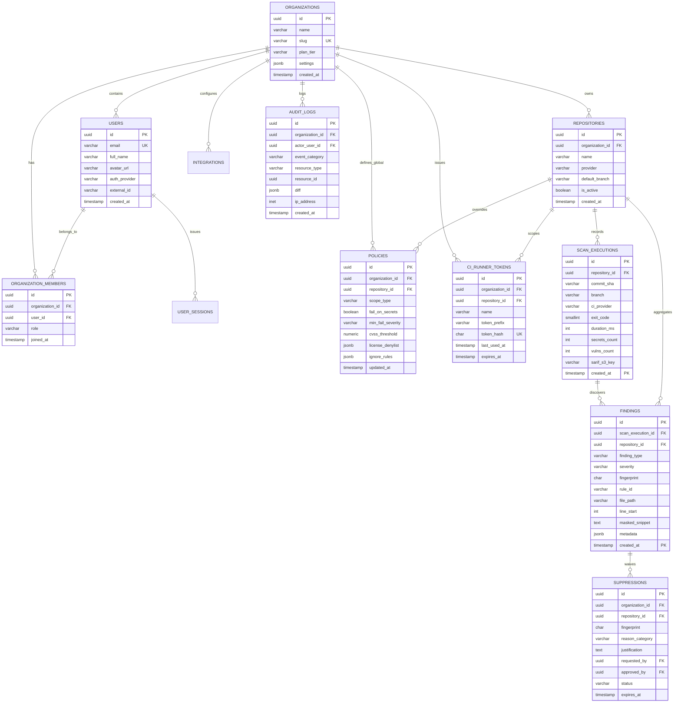

# GateSentry Backend Database Schema & Data Architecture Specification
**Product:** GateSentry — CI/CD Security Scanner & Enterprise Policy Enforcement Platform  
**Document Type:** Senior Backend Engineering Schema & Data Architecture Specification  
**Version:** 1.0.0  
**Target Engine:** PostgreSQL 16 (with Redis 7.2 for caching & session store)  
**Companion Documents:** [PRD.md](file:///d:/CICD%20Scanner/PRD.md) | [TRD.md](file:///d:/CICD%20Scanner/TRD.md) | [APP_FLOW.md](file:///d:/CICD%20Scanner/APP_FLOW.md) | [DESIGN_BRIEF.md](file:///d:/CICD%20Scanner/DESIGN_BRIEF.md)

---

## 1. Architectural Overview & Design Principles

GateSentry requires a high-throughput, multi-tenant relational data store capable of handling:
1. **High Ingestion Throughput:** Hundreds of concurrent CI runners transmitting multi-megabyte SARIF payloads and millions of normalized finding records per month.
2. **Strict Multi-Tenancy & Tenant Isolation:** Absolute tenant boundary enforcement at the schema and query layer (`organization_id` scoping).
3. **Partitioned Append-Only Telemetry:** Time-series partitioning (monthly) on high-cardinality tables (`scan_executions` and `findings`) to guarantee query index efficiency and manageable archival lifecycles.
4. **Fast Machine-to-Machine Auth:** Constant-time ($<2\text{ms}$) verification of scoped CI runner tokens (`gs_live_...`) with Redis caching and SHA-256 hashing.
5. **Zero-Plaintext-Secret Guarantee:** Database check constraints preventing unmasked credentials or arbitrary raw source code files from ever persisting.

---

## 2. Complete Entity-Relationship Diagram (ERD)



---

## 3. PostgreSQL 16 DDL Specifications

### 3.1 Extensions, Custom Types & Enums

```sql
-- Enable cryptographic and UUID extensions
CREATE EXTENSION IF NOT EXISTS "uuid-ossp";
CREATE EXTENSION IF NOT EXISTS "pgcrypto";
CREATE EXTENSION IF NOT EXISTS "btree_gist";

-- Custom Enums
CREATE TYPE user_role AS ENUM (
    'SUPER_ADMIN',
    'APPSEC_ADMIN',
    'DEVOPS_ENGINEER',
    'DEVELOPER'
);

CREATE TYPE git_provider AS ENUM (
    'github',
    'gitlab',
    'bitbucket',
    'custom'
);

CREATE TYPE ci_provider_type AS ENUM (
    'github-actions',
    'gitlab-ci',
    'bitbucket-pipelines',
    'jenkins',
    'circleci',
    'cli-local'
);

CREATE TYPE finding_category AS ENUM (
    'SECRET',
    'CVE',
    'LICENSE'
);

CREATE TYPE severity_level AS ENUM (
    'CRITICAL',
    'HIGH',
    'MEDIUM',
    'LOW',
    'INFO'
);

CREATE TYPE waiver_status AS ENUM (
    'PENDING_APPROVAL',
    'APPROVED',
    'REJECTED',
    'REVOKED',
    'EXPIRED'
);

CREATE TYPE waiver_category AS ENUM (
    'FALSE_POSITIVE',
    'TEST_FIXTURE',
    'UPSTREAM_PATCH_PENDING',
    'COMPENSATING_CONTROL'
);

CREATE TYPE policy_scope AS ENUM (
    'ORGANIZATION_GLOBAL',
    'REPOSITORY_OVERRIDE'
);
```

---

### 3.2 Organizations, Users & Tenancy

```sql
-- 1. Organizations (Top-level Multi-Tenant Root)
CREATE TABLE organizations (
    id UUID PRIMARY KEY DEFAULT gen_random_uuid(),
    name VARCHAR(255) NOT NULL,
    slug VARCHAR(100) NOT NULL UNIQUE,
    plan_tier VARCHAR(50) NOT NULL DEFAULT 'ENTERPRISE',
    sso_enabled BOOLEAN NOT NULL DEFAULT FALSE,
    sso_domain VARCHAR(255),
    settings JSONB NOT NULL DEFAULT '{
        "require_mfa": false,
        "default_waiver_max_days": 90,
        "notify_on_critical_secret": true
    }'::jsonb,
    created_at TIMESTAMPTZ NOT NULL DEFAULT NOW(),
    updated_at TIMESTAMPTZ NOT NULL DEFAULT NOW(),
    CONSTRAINT chk_org_slug_format CHECK (slug ~* '^[a-z0-9-]+$')
);

CREATE INDEX idx_organizations_slug ON organizations(slug);

-- 2. Users (Human Dashboard Identities)
CREATE TABLE users (
    id UUID PRIMARY KEY DEFAULT gen_random_uuid(),
    email VARCHAR(255) NOT NULL UNIQUE,
    full_name VARCHAR(255) NOT NULL,
    avatar_url VARCHAR(1024),
    auth_provider VARCHAR(50) NOT NULL, -- 'github', 'gitlab', 'google', 'saml'
    external_provider_id VARCHAR(255) NOT NULL,
    is_active BOOLEAN NOT NULL DEFAULT TRUE,
    created_at TIMESTAMPTZ NOT NULL DEFAULT NOW(),
    updated_at TIMESTAMPTZ NOT NULL DEFAULT NOW(),
    CONSTRAINT uq_provider_external_id UNIQUE (auth_provider, external_provider_id)
);

CREATE INDEX idx_users_email ON users(email);

-- 3. Organization Memberships (Tenancy Junction & RBAC)
CREATE TABLE organization_members (
    id UUID PRIMARY KEY DEFAULT gen_random_uuid(),
    organization_id UUID NOT NULL REFERENCES organizations(id) ON DELETE CASCADE,
    user_id UUID NOT NULL REFERENCES users(id) ON DELETE CASCADE,
    role user_role NOT NULL DEFAULT 'DEVELOPER',
    joined_at TIMESTAMPTZ NOT NULL DEFAULT NOW(),
    CONSTRAINT uq_org_user UNIQUE (organization_id, user_id)
);

CREATE INDEX idx_org_members_org ON organization_members(organization_id);
CREATE INDEX idx_org_members_user ON organization_members(user_id);

-- 4. User Sessions & Refresh Tokens
CREATE TABLE user_sessions (
    id UUID PRIMARY KEY DEFAULT gen_random_uuid(),
    user_id UUID NOT NULL REFERENCES users(id) ON DELETE CASCADE,
    refresh_token_hash CHAR(64) NOT NULL UNIQUE,
    user_agent VARCHAR(512),
    ip_address INET,
    expires_at TIMESTAMPTZ NOT NULL,
    revoked_at TIMESTAMPTZ,
    created_at TIMESTAMPTZ NOT NULL DEFAULT NOW()
);

CREATE INDEX idx_sessions_user ON user_sessions(user_id) WHERE revoked_at IS NULL;
CREATE INDEX idx_sessions_token ON user_sessions(refresh_token_hash);
```

---

### 3.3 Repositories & Machine Ingestion Tokens

```sql
-- 5. Repositories Registry
CREATE TABLE repositories (
    id UUID PRIMARY KEY DEFAULT gen_random_uuid(),
    organization_id UUID NOT NULL REFERENCES organizations(id) ON DELETE CASCADE,
    external_repo_id VARCHAR(255),
    name VARCHAR(255) NOT NULL, -- e.g. "checkout-api" or "acme/checkout-api"
    provider git_provider NOT NULL DEFAULT 'github',
    default_branch VARCHAR(100) NOT NULL DEFAULT 'main',
    clone_url VARCHAR(1024),
    is_active BOOLEAN NOT NULL DEFAULT TRUE,
    last_scanned_at TIMESTAMPTZ,
    created_at TIMESTAMPTZ NOT NULL DEFAULT NOW(),
    updated_at TIMESTAMPTZ NOT NULL DEFAULT NOW(),
    CONSTRAINT uq_org_repo_name UNIQUE (organization_id, name)
);

CREATE INDEX idx_repositories_org ON repositories(organization_id);
CREATE INDEX idx_repositories_active ON repositories(organization_id, is_active);

-- 6. CI Runner Ingestion Tokens (Machine Auth)
CREATE TABLE ci_runner_tokens (
    id UUID PRIMARY KEY DEFAULT gen_random_uuid(),
    organization_id UUID NOT NULL REFERENCES organizations(id) ON DELETE CASCADE,
    repository_id UUID REFERENCES repositories(id) ON DELETE CASCADE, -- NULL indicates Org-wide token
    name VARCHAR(255) NOT NULL,
    token_prefix VARCHAR(16) NOT NULL, -- e.g. "gs_live_9f83a" (for identification)
    token_hash CHAR(64) NOT NULL UNIQUE, -- SHA-256(raw_secret)
    created_by_user_id UUID REFERENCES users(id) ON DELETE SET NULL,
    last_used_at TIMESTAMPTZ,
    expires_at TIMESTAMPTZ,
    revoked_at TIMESTAMPTZ,
    created_at TIMESTAMPTZ NOT NULL DEFAULT NOW(),
    CONSTRAINT chk_token_prefix CHECK (token_prefix ~* '^gs_live_[a-z0-9]{4,10}$')
);

CREATE INDEX idx_ci_tokens_hash ON ci_runner_tokens(token_hash) WHERE revoked_at IS NULL;
CREATE INDEX idx_ci_tokens_org ON ci_runner_tokens(organization_id);
```

---

### 3.4 Policy Management Engine

```sql
-- 7. Security Policies (Org-Wide & Repository-Specific Overrides)
CREATE TABLE policies (
    id UUID PRIMARY KEY DEFAULT gen_random_uuid(),
    organization_id UUID NOT NULL REFERENCES organizations(id) ON DELETE CASCADE,
    repository_id UUID REFERENCES repositories(id) ON DELETE CASCADE, -- NULL = Org Global Policy
    scope_type policy_scope NOT NULL DEFAULT 'ORGANIZATION_GLOBAL',
    version VARCHAR(20) NOT NULL DEFAULT '1.0',
    fail_on_secrets BOOLEAN NOT NULL DEFAULT TRUE,
    min_fail_severity severity_level NOT NULL DEFAULT 'HIGH',
    cvss_threshold NUMERIC(3, 1) NOT NULL DEFAULT 7.0 CHECK (cvss_threshold >= 0.0 AND cvss_threshold <= 10.0),
    entropy_threshold NUMERIC(3, 2) NOT NULL DEFAULT 4.5 CHECK (entropy_threshold >= 1.0 AND entropy_threshold <= 8.0),
    scan_git_history BOOLEAN NOT NULL DEFAULT FALSE,
    license_denylist JSONB NOT NULL DEFAULT '["AGPL-3.0", "GPL-3.0", "SSPL-1.0"]'::jsonb,
    ignore_paths JSONB NOT NULL DEFAULT '["tests/**", "docs/**", "**/*.test.*"]'::jsonb,
    custom_rules JSONB NOT NULL DEFAULT '[]'::jsonb,
    updated_by_user_id UUID REFERENCES users(id) ON DELETE SET NULL,
    created_at TIMESTAMPTZ NOT NULL DEFAULT NOW(),
    updated_at TIMESTAMPTZ NOT NULL DEFAULT NOW(),
    CONSTRAINT uq_policy_scope UNIQUE (organization_id, repository_id)
);

CREATE INDEX idx_policies_lookup ON policies(organization_id, repository_id);
```

---

### 3.5 High-Throughput Scan Executions & Findings (Partitioned)

To handle massive telemetry volume without degradation, `scan_executions` and `findings` are **range-partitioned monthly by `created_at`**.

```sql
-- 8. Scan Executions (Master Partitioned Table)
CREATE TABLE scan_executions (
    id UUID NOT NULL DEFAULT gen_random_uuid(),
    repository_id UUID NOT NULL REFERENCES repositories(id) ON DELETE CASCADE,
    commit_sha CHAR(40) NOT NULL,
    branch VARCHAR(255) NOT NULL,
    ci_provider ci_provider_type NOT NULL,
    triggered_by VARCHAR(255) NOT NULL, -- e.g. "alex@acme.com" or "pull_request #42"
    exit_code SMALLINT NOT NULL CHECK (exit_code IN (0, 1, 2)),
    scan_duration_ms INTEGER NOT NULL CHECK (scan_duration_ms >= 0),
    secrets_count INTEGER NOT NULL DEFAULT 0,
    vulns_count INTEGER NOT NULL DEFAULT 0,
    license_violations_count INTEGER NOT NULL DEFAULT 0,
    sarif_s3_key VARCHAR(512),
    raw_terminal_log_s3_key VARCHAR(512),
    scanner_version VARCHAR(50) NOT NULL DEFAULT '1.0.0',
    created_at TIMESTAMPTZ NOT NULL DEFAULT NOW(),
    PRIMARY KEY (id, created_at)
) PARTITION BY RANGE (created_at);

CREATE INDEX idx_scan_executions_repo_date ON scan_executions(repository_id, created_at DESC);
CREATE INDEX idx_scan_executions_commit ON scan_executions(commit_sha);
CREATE INDEX idx_scan_executions_exit ON scan_executions(exit_code);

-- 9. Findings (Master Partitioned Table)
CREATE TABLE findings (
    id UUID NOT NULL DEFAULT gen_random_uuid(),
    scan_execution_id UUID NOT NULL,
    repository_id UUID NOT NULL REFERENCES repositories(id) ON DELETE CASCADE,
    finding_type finding_category NOT NULL,
    severity severity_level NOT NULL,
    -- Cryptographic fingerprint: SHA256(rule_id + file_path + normalized_signature)
    fingerprint CHAR(64) NOT NULL,
    rule_id VARCHAR(100) NOT NULL,
    file_path VARCHAR(1024) NOT NULL,
    line_start INTEGER CHECK (line_start > 0),
    line_end INTEGER CHECK (line_end >= line_start),
    masked_snippet TEXT NOT NULL,
    is_suppressed BOOLEAN NOT NULL DEFAULT FALSE,
    suppression_id UUID, -- References suppressions table if waived
    -- Metadata contains CVSS vectors, CVE IDs, Package Name, Fixed Versions, Shannon entropy
    metadata JSONB NOT NULL DEFAULT '{}'::jsonb,
    created_at TIMESTAMPTZ NOT NULL DEFAULT NOW(),
    PRIMARY KEY (id, created_at),
    -- Security constraint: Disallow unmasked AWS credentials in database
    CONSTRAINT chk_no_plaintext_aws CHECK (masked_snippet !~ 'AKIA[0-9A-Z]{16}')
) PARTITION BY RANGE (created_at);

CREATE INDEX idx_findings_repo_fingerprint ON findings(repository_id, fingerprint);
CREATE INDEX idx_findings_severity ON findings(severity);
CREATE INDEX idx_findings_type ON findings(finding_type);
CREATE INDEX idx_findings_created ON findings(created_at DESC);
-- GIN Index on polymorphic metadata (allows fast querying on CVEs, packages, and CVSS)
CREATE INDEX idx_findings_metadata_gin ON findings USING GIN (metadata);
```

#### Automated Partition Provisioning (Monthly Schema Pattern)

```sql
-- Initial Monthly Partitions Example (2026 Q3 - Q4)
CREATE TABLE scan_executions_y2026m09 PARTITION OF scan_executions
    FOR VALUES FROM ('2026-09-01 00:00:00+00') TO ('2026-10-01 00:00:00+00');

CREATE TABLE scan_executions_y2026m10 PARTITION OF scan_executions
    FOR VALUES FROM ('2026-10-01 00:00:00+00') TO ('2026-11-01 00:00:00+00');

CREATE TABLE scan_executions_default PARTITION OF scan_executions DEFAULT;

CREATE TABLE findings_y2026m09 PARTITION OF findings
    FOR VALUES FROM ('2026-09-01 00:00:00+00') TO ('2026-10-01 00:00:00+00');

CREATE TABLE findings_y2026m10 PARTITION OF findings
    FOR VALUES FROM ('2026-10-01 00:00:00+00') TO ('2026-11-01 00:00:00+00');

CREATE TABLE findings_default PARTITION OF findings DEFAULT;
```

---

### 3.6 Waivers, Suppressions & Governance

```sql
-- 10. Suppressions (Waivers / Exceptions)
CREATE TABLE suppressions (
    id UUID PRIMARY KEY DEFAULT gen_random_uuid(),
    organization_id UUID NOT NULL REFERENCES organizations(id) ON DELETE CASCADE,
    repository_id UUID NOT NULL REFERENCES repositories(id) ON DELETE CASCADE,
    fingerprint CHAR(64) NOT NULL,
    rule_id VARCHAR(100) NOT NULL,
    reason_category waiver_category NOT NULL,
    justification TEXT NOT NULL,
    status waiver_status NOT NULL DEFAULT 'PENDING_APPROVAL',
    requested_by_user_id UUID NOT NULL REFERENCES users(id) ON DELETE RESTRICT,
    approved_by_user_id UUID REFERENCES users(id) ON DELETE RESTRICT,
    rejection_reason TEXT,
    expires_at TIMESTAMPTZ NOT NULL,
    created_at TIMESTAMPTZ NOT NULL DEFAULT NOW(),
    updated_at TIMESTAMPTZ NOT NULL DEFAULT NOW(),
    CONSTRAINT uq_repo_active_fingerprint UNIQUE (repository_id, fingerprint),
    CONSTRAINT chk_justification_len CHECK (char_length(justification) >= 20)
);

CREATE INDEX idx_suppressions_active ON suppressions(repository_id, fingerprint) 
    WHERE status = 'APPROVED';
CREATE INDEX idx_suppressions_org_status ON suppressions(organization_id, status);
CREATE INDEX idx_suppressions_expiry ON suppressions(expires_at) 
    WHERE status = 'APPROVED';
```

---

### 3.7 Integrations, Notifications & Audit Logs

```sql
-- 11. Third-Party Integrations (Slack, Jira, Linear Webhooks)
CREATE TABLE integrations (
    id UUID PRIMARY KEY DEFAULT gen_random_uuid(),
    organization_id UUID NOT NULL REFERENCES organizations(id) ON DELETE CASCADE,
    provider VARCHAR(50) NOT NULL, -- 'slack', 'jira', 'linear', 'webhook'
    name VARCHAR(255) NOT NULL,
    webhook_url_encrypted TEXT, -- Encrypted using AES-256-GCM
    api_token_encrypted TEXT,
    events JSONB NOT NULL DEFAULT '["build_broken", "secret_leaked", "waiver_requested"]'::jsonb,
    is_active BOOLEAN NOT NULL DEFAULT TRUE,
    created_at TIMESTAMPTZ NOT NULL DEFAULT NOW(),
    updated_at TIMESTAMPTZ NOT NULL DEFAULT NOW()
);

CREATE INDEX idx_integrations_org ON integrations(organization_id);

-- 12. Immutable Audit Logs (SOC 2 & ISO 27001 Compliance Trail)
CREATE TABLE audit_logs (
    id UUID PRIMARY KEY DEFAULT gen_random_uuid(),
    organization_id UUID NOT NULL REFERENCES organizations(id) ON DELETE CASCADE,
    actor_user_id UUID REFERENCES users(id) ON DELETE SET NULL,
    actor_email VARCHAR(255) NOT NULL,
    event_category VARCHAR(100) NOT NULL, -- 'POLICY_UPDATED', 'WAIVER_APPROVED', 'TOKEN_REVOKED'
    resource_type VARCHAR(100) NOT NULL,  -- 'POLICY', 'SUPPRESSION', 'CI_TOKEN'
    resource_id UUID NOT NULL,
    diff JSONB DEFAULT '{}'::jsonb,      -- Stores {"before": {...}, "after": {...}}
    ip_address INET,
    user_agent VARCHAR(512),
    created_at TIMESTAMPTZ NOT NULL DEFAULT NOW()
);

CREATE INDEX idx_audit_logs_org_date ON audit_logs(organization_id, created_at DESC);
CREATE INDEX idx_audit_logs_resource ON audit_logs(resource_type, resource_id);

-- 13. Advisory Intelligence Cache (OSV.dev & NVD Offline Mirror)
CREATE TABLE advisory_cache (
    id UUID PRIMARY KEY DEFAULT gen_random_uuid(),
    ecosystem VARCHAR(50) NOT NULL, -- 'npm', 'PyPI', 'Go', 'Maven'
    package_name VARCHAR(255) NOT NULL,
    version VARCHAR(100) NOT NULL,
    advisory_id VARCHAR(100) NOT NULL, -- 'GHSA-xxxx' or 'CVE-2023-xxxx'
    severity severity_level NOT NULL,
    cvss_score NUMERIC(3, 1),
    cvss_vector VARCHAR(100),
    fixed_version VARCHAR(100),
    summary TEXT,
    payload JSONB NOT NULL,
    cached_at TIMESTAMPTZ NOT NULL DEFAULT NOW(),
    expires_at TIMESTAMPTZ NOT NULL,
    CONSTRAINT uq_pkg_version_advisory UNIQUE (ecosystem, package_name, version, advisory_id)
);

CREATE INDEX idx_advisory_lookup ON advisory_cache(ecosystem, package_name, version);
CREATE INDEX idx_advisory_expiry ON advisory_cache(expires_at);
```

---

## 4. In-Memory Data Models & Caching (Redis 7.2)

Redis acts as the high-speed L1 cache and async queue broker (`hibiken/asynq`).

### 4.1 Key-Value Architecture & TTL Strategies

| Key Pattern | Data Structure | TTL | Purpose |
| :--- | :--- | :--- | :--- |
| `auth:token:<sha256_hash>` | String (JSON) | 15 minutes | Cached CI runner verification token (avoids DB hit on ingest). |
| `policy:repo:<repo_id>` | Hash | 1 hour | Pinned policy rules + active suppressions for fast CLI query. |
| `session:<user_id>:<session_id>` | Hash | 7 days | Active user session state & permissions. |
| `rate:ingest:<ip_or_token>` | Integer (Token Bucket) | 60 seconds | Sliding window rate limiter for scan uploads (100 req/min). |
| `asynq:queue:sarif_ingest` | Sorted Set (Asynq) | N/A | Worker queue holding pending SARIF decompression & deduplication jobs. |

---

## 5. Authentication, Machine Ingestion & Permissions (RBAC)

### 5.1 CI/CD Machine Authentication Workflow

```
┌───────────────────────────┐          ┌───────────────────────────┐          ┌───────────────────────────┐
│ CI/CD Runner Execution    │          │ GateSentry API Gateway    │          │ Redis & Postgres L2 Cache │
└─────────────┬─────────────┘          └─────────────┬─────────────┘          └─────────────┬─────────────┘
              │                                      │                                      │
              │ 1. POST /api/v1/scans/ingest         │                                      │
              │    Header: Bearer gs_live_9f83...    │                                      │
              ├─────────────────────────────────────►│                                      │
              │                                      │ 2. Compute SHA-256(token)            │
              │                                      │ 3. Check Redis: auth:token:<hash>    │
              │                                      ├─────────────────────────────────────►│
              │                                      │                                      │
              │                                      │◄─────────────────────────────────────┤
              │                                      │    (HIT: Return org_id, repo_id)     │
              │                                      │                                      │
              │ 4. Return 202 Accepted (Queued)      │                                      │
              │◄─────────────────────────────────────┤                                      │
```

1. The runner supplies token: `Authorization: Bearer gs_live_9f83a...`
2. The Gateway computes `token_hash = SHA256(token_secret)`.
3. Checks Redis key `auth:token:<token_hash>`. On cache miss, queries table `ci_runner_tokens`:
   ```sql
   SELECT organization_id, repository_id 
   FROM ci_runner_tokens 
   WHERE token_hash = $1 
     AND revoked_at IS NULL 
     AND (expires_at IS NULL OR expires_at > NOW());
   ```
4. If token is invalid or expired, immediately aborts with `HTTP 401 Unauthorized`.
5. If valid, populates Redis cache with 15-minute TTL and sets request context with `organization_id` and `repository_id`.

---

### 5.2 Role-Based Access Control (RBAC) Enforcement Engine

Each request is authorized by comparing the user's role in `organization_members` against the requested action.

```
┌──────────────────────────────────────────────┬──────────────┬─────────────┬──────────────┬───────────┐
│ Permission Capability                        │ SUPER_ADMIN  │ APPSEC_ADMIN│ DEVOPS_ENG   │ DEVELOPER │
├──────────────────────────────────────────────┼──────────────┼─────────────┼──────────────┼───────────┤
│ View Dashboard, Scans & Findings             │      ✅      │     ✅      │      ✅      │    ✅     │
│ Submit Waiver / Suppression Request          │      ✅      │     ✅      │      ✅      │    ✅     │
│ Approve or Reject Waiver Requests            │      ✅      │     ✅      │      ❌      │    ❌     │
│ Author & Publish Global / Repo Policies      │      ✅      │     ✅      │      ❌      │    ❌     │
│ Connect New Repos & Generate CI Tokens       │      ✅      │     ✅      │      ✅      │    ❌     │
│ Revoke CI Tokens & Delete Repositories       │      ✅      │     ✅      │      ✅      │    ❌     │
│ Manage Org SSO, Members & Billing            │      ✅      │     ❌      │      ❌      │    ❌     │
│ Export Compliance Audit Package (SOC 2)      │      ✅      │     ✅      │      ❌      │    ❌     │
└──────────────────────────────────────────────┴──────────────┴─────────────┴──────────────┴───────────┘
```

---

## 6. Data Ownership, Multi-Tenancy & Privacy Guardrails

### 6.1 Row-Level Multi-Tenant Isolation
All backend queries must enforce explicit tenant boundaries. The application data access layer encapsulates this by injecting the authenticated `organization_id` into every SQL statement:

```sql
-- Safe Finding Query Pattern
SELECT f.* 
FROM findings f
JOIN repositories r ON f.repository_id = r.id
WHERE r.organization_id = $authenticated_org_id
  AND f.severity = 'CRITICAL'
ORDER BY f.created_at DESC;
```

### 6.2 Zero-Knowledge Source Code Guardrail
GateSentry enforces a strict **Zero-Code Retention Policy**:
1. No source code files (`.py`, `.ts`, `.go`, etc.) are ever stored in PostgreSQL or S3.
2. Only **masked snippets** are saved in the `findings.masked_snippet` column.
3. Check constraint `chk_no_plaintext_aws` actively rejects insertions containing raw unmasked tokens (`AKIA[0-9A-Z]{16}`).
4. Snippets are capped at a maximum of 512 characters.

### 6.3 Soft Deletion & Audit Retention Policy
- **Organizations & Repositories:** Marking a repository inactive sets `repositories.is_active = FALSE`. Hard deletion triggers `ON DELETE CASCADE` across scan runs and findings.
- **Audit Logs:** Immutable. Records in `audit_logs` are write-only (`INSERT` only; `UPDATE` and `DELETE` privileges are strictly revoked from the application DB role).
- **S3 SARIF Artifacts:** Configured with Object Lock (WORM compliance) with a 365-day lifecycle transition to Glacier.

---
*End of GateSentry Backend Database Schema & Data Architecture Specification. This document serves as the implementation contract for database migrations, ORM entities, and backend service development.*

