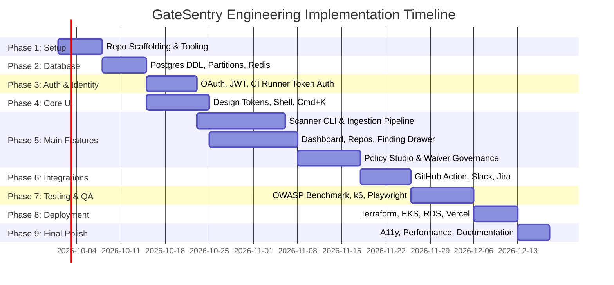

# GateSentry End-to-End Implementation Plan & Engineering Roadmap
**Product:** GateSentry — CI/CD Security Scanner & Enterprise Policy Enforcement Platform  
**Document Type:** Senior Full-Stack Engineering Roadmap & Project Execution Plan  
**Version:** 1.0.0  
**Status:** Approved for Execution  
**Companion Documents:** [PRD.md](file:///d:/CICD%20Scanner/PRD.md) | [TRD.md](file:///d:/CICD%20Scanner/TRD.md) | [APP_FLOW.md](file:///d:/CICD%20Scanner/APP_FLOW.md) | [DESIGN_BRIEF.md](file:///d:/CICD%20Scanner/DESIGN_BRIEF.md) | [BACKEND_SCHEMA.md](file:///d:/CICD%20Scanner/BACKEND_SCHEMA.md)

---

## 1. Project Management Overview & Execution Strategy

### 1.1 Architecture & Repository Strategy
GateSentry is architected as a cohesive **polyglot monorepo** (or coordinated dual-repo structure) comprising:
- **`scanner/` (CLI & Runner Core):** Standalone static Go 1.22+ binary, compiled across `linux/amd64`, `linux/arm64`, `darwin/amd64`, `darwin/arm64`, `windows/amd64`.
- **`backend/` (API & Ingestion Worker):** Go (Gin/Chi) modular monolith serving RESTful APIs and asynchronous SARIF ingestion queues backed by PostgreSQL 16, Redis 7.2, and S3.
- **`frontend/` (Dashboard & Portal):** Next.js 14 App Router, TypeScript 5.4, Tailwind CSS, Radix UI Primitives, and Monaco Editor.

### 1.2 Phased Milestones Timeline Overview

---

## 2. Phase-by-Phase Engineering Roadmap

---

### Phase 1: Project Setup & Developer Infrastructure
- **Objective:** Establish developer ergonomics, repository scaffolding, linting standards, container configurations, and CI/CD development pipelines.
- **Timeline:** Week 1 (Days 1–5)

#### Key Engineering Tasks
1. **Repository Structure:**
   - Initialize root workspace with Go 1.22 module (`go.mod`), Node.js/pnpm workspace (`pnpm-workspace.yaml`), and Docker compose file.
2. **Local Development Containerization (`docker-compose.yml`):**
   - Configure PostgreSQL 16 (port 5432) with pre-loaded extensions (`uuid-ossp`, `pgcrypto`).
   - Configure Redis 7.2 (port 6379) with AOF persistence.
   - Configure LocalStack / MinIO for local S3-compatible SARIF object storage.
3. **Tooling & Pre-Commit Guardrails:**
   - Setup `golangci-lint` with strict configuration (zero unhandled errors, memory alignment).
   - Setup ESLint 9, Prettier, and Husky pre-commit hooks (verifying types with `tsc --noEmit`).
   - Setup Makefile / Taskfile for single-command bootstrap: `make dev`.

#### Deliverables for Phase 1
- [x] Operational `docker-compose.yml` hosting Postgres, Redis, and MinIO.
- [x] Scaffolding directories: `/cmd/gatesentry`, `/pkg/scanner`, `/services/api`, `/web`.
- [x] Automated pre-commit hooks preventing unformatted or broken commits.
- [x] Validated local build check: `make test` runs green across Go and TypeScript packages.

---

### Phase 2: Database Layer & Data Architecture
- **Objective:** Provision the complete relational schema, automated monthly table partitioning, Redis caching keys, and database migration pipelines.
- **Timeline:** Week 2 (Days 6–10)
- **Prerequisites:** Phase 1 complete.

#### Key Engineering Tasks
1. **Database Migrations Engine:**
   - Implement database migrations using `golang-migrate/migrate` or `go-migrate` CLI.
2. **Table Schema Execution:**
   - Execute baseline migration scripts from [`BACKEND_SCHEMA.md`](file:///d:/CICD%20Scanner/BACKEND_SCHEMA.md):
     - `organizations`, `users`, `organization_members`, `user_sessions`.
     - `repositories`, `ci_runner_tokens`, `policies`, `suppressions`, `audit_logs`, `integrations`.
3. **Partitioning Infrastructure:**
   - Provision range-partitioned tables for `scan_executions` and `findings` (monthly partitions on `created_at`).
   - Create automated database trigger / CronJob function `create_next_month_partitions()` to provision upcoming monthly tables ahead of schedule.
4. **Data Access Layer & ORM/Query Builder:**
   - Implement data models and high-performance typed query layer using Go `sqlc` or `pgx/v5` connection pooling.
   - Implement Redis data access methods for token hash caching and sliding-window rate limiting.

#### Deliverables for Phase 2
- [x] Fully executed migration suite (`001_initial_schema.up.sql`).
- [x] Initial partitions for current and upcoming months (`scan_executions_y2026m09`, `findings_y2026m09`).
- [x] Unit test suite verifying schema check constraints (verifying `chk_no_plaintext_aws` rejects unmasked credentials).
- [x] Automated seed script (`make seed`) generating sample org, repositories, and mock scans.

---

### Phase 3: Authentication & Authorization (IAM)
- **Objective:** Deliver human dashboard login flows and high-speed CI machine token authorization.
- **Timeline:** Week 3 (Days 11–15)
- **Prerequisites:** Phase 2 complete.

#### Key Engineering Tasks
1. **Human User Auth (Domain 1):**
   - Integrate NextAuth / Lucia Auth or Go OAuth2 handlers for GitHub, GitLab, and Google Workspace.
   - Implement short-lived JWT generation (15-min lifespan) signed with RS256 private key.
   - Implement database/Redis-backed refresh token rotation with user-agent and IP logging.
2. **Machine CI Runner Auth (Domain 2):**
   - Implement token generator creating cryptographically secure keys: `gs_live_<64_char_hex>`.
   - Store SHA-256 hash in `ci_runner_tokens.token_hash` and cache in Redis with 15-minute TTL.
   - Implement fast Go HTTP authentication middleware verifying runner requests in $<2\text{ms}$.
3. **RBAC Guardrails & Tenant Context Middleware:**
   - Implement HTTP interceptor extracting `organization_id` from JWT / CI token, injecting into Go `context.Context`.
   - Enforce RBAC permission matrix (`SUPER_ADMIN`, `APPSEC_ADMIN`, `DEVOPS_ENGINEER`, `DEVELOPER`).

#### Deliverables for Phase 3
- [x] Operational `/login` and OAuth callback endpoints.
- [x] CI runner authentication middleware (`RequireRunnerToken()`).
- [x] Token generation endpoint returning single-reveal token secrets.
- [x] Automated test suite verifying unauthorized access returns HTTP 401 and cross-tenant requests return HTTP 403.

---

### Phase 4: Core UI & Global Design System
- **Objective:** Construct the frontend application shell, design tokens, responsive layouts, and reusable components defined in the Design Brief.
- **Timeline:** Week 4 (Days 16–20)
- **Prerequisites:** Phase 1 complete.

#### Key Engineering Tasks
1. **Design System & Tailwind Token Integration:**
   - Configure `tailwind.config.js` with color tiers (`#080B11`, `#0E131F`, `#141B2D`), semantic severity colors, and font families (`Inter`, `JetBrains Mono`).
   - Setup dark mode classes and smooth CSS transitions.
2. **Global Shell & Layout Architecture:**
   - Build Fixed Topbar (`LAYOUT-TOPBAR`): Org selector, active runner activity indicator, notification popover, profile dropdown.
   - Build Collapsible Left Sidebar (`LAYOUT-SIDEBAR`): Dynamic badge counts for active findings and pending waivers.
   - Implement `Cmd+K` Command Palette modal with fuzzy search across repos, findings, and rule IDs.
3. **Atomic UI Component Library (Radix UI + Tailwind):**
   - Buttons (Primary, Secondary, Ghost, Destructive).
   - Severity Badges (Critical with pulsing red dot, High, Medium, Low, Pass).
   - Card containers, Dialog modals, Slide-in Drawers, and Tab groups.
   - Data Table component with sortable headers, virtualized scrolling, and shimmering skeleton states.

#### Deliverables for Phase 4
- [x] Fully responsive global shell with collapsible sidebar and mobile drawer navigation.
- [x] Functional `Cmd+K` global command palette.
- [x] Reusable component storybook / playground verifying accessibility and hover states.
- [x] Skeleton loading states for cards, tables, and metric widgets.

---

### Phase 5: Main Features Implementation

#### 5.1 CLI Scanner Engine & Telemetry Ingestion (Sprint 5A)
- **Timeline:** Week 5–6 (Days 21–28)
- **Engineering Tasks:**
  1. **Secret Scanning Engine:**
     - Implement Regex pre-filter covering 25+ token signatures (AWS, GitHub, Slack, Private Keys).
     - Implement Shannon Entropy calculation function with exclusion heuristics.
     - Implement zero-disclosure string masker (reveals first 4 chars, masks rest with `*`).
  2. **Dependency & SCA Parser:**
     - Implement lockfile parsers for Node.js (`package-lock.json`), Python (`requirements.txt`, `poetry.lock`), and Go (`go.sum`).
     - Query OSV.dev batch API (`https://api.osv.dev/v1/querybatch`) with cached fallback.
  3. **Local Policy Gate & Exit Codes:**
     - Evaluate `.gatesentry.yml` rules. Strictly return `exit 0` (Pass), `exit 1` (Violation), or `exit 2` (Error).
     - Produce OASIS SARIF v2.1.0 and formatted ANSI terminal output.
  4. **SARIF Ingestion Worker:**
     - Endpoint `POST /api/v1/scans/ingest` storing raw SARIF in S3 and dispatching async job to Redis/Asynq.
     - Worker deduplicates findings, generates SHA-256 fingerprints, and populates `findings` table.

#### 5.2 Dashboard, Repositories & Finding Triage (Sprint 5B)
- **Timeline:** Week 6–7 (Days 29–35)
- **Engineering Tasks:**
  1. **Executive Dashboard (`SCR-03`):**
     - Four KPI cards with real-time deltas and sparklines.
     - 30-day exposure trend chart (Recharts Multi-Area).
     - Live CI/CD activity feed with Server-Sent Events (SSE) updates.
  2. **Repository Matrix & Detail View (`SCR-04`, `SCR-05`):**
     - Fleet table with branch health indicators and filters.
     - Sub-tabs: Overview, Scan Runs, Findings, Policies, Settings.
  3. **Scan Run Diagnostics (`SCR-06`):**
     - Post-mortem page displaying exact exit code breakdown, raw terminal ANSI logs, and SARIF download.
  4. **Finding Matrix & Triage Drawer (`SCR-07`, `DRAWER-01`):**
     - Central findings filter bar (Type, Severity, Status, Repo).
     - Slide-in triage drawer featuring read-only Monaco code editor highlighting masked evidence.
     - Step-by-step remediation guide with 1-click copy commands.

#### 5.3 Policy Studio & Waiver Governance (Sprint 5C)
- **Timeline:** Week 7–8 (Days 36–42)
- **Engineering Tasks:**
  1. **Policy Studio & Rule Builder (`SCR-09`):**
     - Interactive form controls (entropy slider, severity dropdowns, license denylist).
     - Two-way synchronized Monaco YAML editor showing generated `.gatesentry.yml`.
     - "Test Policy Dry-Run" feature simulating rules against historical repo scans.
  2. **Waiver & Exception Portal (`SCR-08`, `MOD-02`):**
     - "Request Waiver" modal with justification validation (min 20 chars) and duration picker.
     - AppSec governance workstation: 1-click Approve / Reject actions.
     - Instant suppression fingerprint generation in Redis to unblock subsequent CI runs.

#### Deliverables for Phase 5
- [x] Standalone compiled CLI binary producing correct exit codes and SARIF reports.
- [x] Asynchronous ingestion worker processing 5MB SARIF payloads in $<500\text{ms}$.
- [x] Operational Executive Dashboard, Repository Matrix, and Scan Run detail pages.
- [x] Fully functioning Finding Triage Drawer with masked Monaco code preview.
- [x] Interactive Policy Studio with live YAML synchronization and dry-run engine.
- [x] Complete Waiver Request & Approval workflow.

---

### Phase 6: Integrations & Notifications
- **Objective:** Connect GateSentry into modern developer workflows (GitHub, Slack, Jira).
- **Timeline:** Week 9 (Days 43–47)
- **Prerequisites:** Phase 5 complete.

#### Key Engineering Tasks
1. **GitHub Marketplace Action (`action.yml`):**
   - Package ready-to-use composite GitHub Action referencing `ghcr.io/gatesentry/scanner:latest`.
   - Post PR summary comments and publish SARIF to GitHub Code Scanning API.
2. **Notification Webhook Handlers:**
   - Slack and Microsoft Teams notification dispatchers for `BUILD_BROKEN`, `CRITICAL_SECRET_LEAKED`, and `WAIVER_REQUESTED`.
3. **Issue Tracker Integrations:**
   - Jira and Linear 1-click ticket export from Finding Drawer via OAuth/API integration.

#### Deliverables for Phase 6
- [x] Published `action.yml` usable in any `.github/workflows/security.yml`.
- [x] Instant Slack alerts with masked snippets and direct links to the Triage Drawer.
- [x] Functional "Export to Jira" integration creating structured vulnerability tickets.

---

### Phase 7: Testing, Quality Assurance & Benchmarks
- **Objective:** Rigorously validate scanner accuracy, backend ingestion scale, and UI resilience.
- **Timeline:** Week 10 (Days 48–52)
- **Prerequisites:** Phases 5 & 6 complete.

#### Key Engineering Tasks
1. **OWASP Secret Benchmark Validation:**
   - Run CLI engine against OWASP Secret Benchmark suite. Assert 100% detection rate on true positives.
   - Run scanner across 50 popular open-source repositories to assert $<3\%$ false-positive rate.
2. **Backend Ingestion Load Testing (`k6`):**
   - Simulate 500 concurrent CI runners uploading 5MB SARIF payloads.
   - Assert $P_{99}$ response time remains $<200\text{ms}$ and zero queue dropouts occur.
3. **End-to-End UI Testing (Playwright):**
   - Automate happy paths: Login $\to$ Connect Repo $\to$ Inspect Broken Scan $\to$ Request Waiver $\to$ AppSec Approves $\to$ CI Passes.
4. **Failure & Offline Resilience Testing:**
   - Validate CLI behavior when disconnected from the network (air-gapped fallback to embedded OSV database).

#### Deliverables for Phase 7
- [x] Automated test report verifying OWASP benchmark scores and false-positive thresholds.
- [x] k6 performance test report demonstrating compliance with non-functional SLA targets.
- [x] Playwright test suite passing 100% across Chromium, Firefox, and WebKit.

---

### Phase 8: Production Deployment & Infrastructure as Code (IaC)
- **Objective:** Deploy production-grade cloud infrastructure on AWS/GCP with automated scaling and monitoring.
- **Timeline:** Week 11 (Days 53–57)
- **Prerequisites:** Phase 7 complete.

#### Key Engineering Tasks
1. **Terraform Infrastructure as Code:**
   - Amazon EKS cluster with Karpenter autoscaling.
   - Amazon Aurora Serverless v2 PostgreSQL (Multi-AZ with encrypted storage).
   - Amazon ElastiCache Redis Cluster (TLS enabled).
   - S3 Bucket configured with WORM Object Lock for raw SARIF retention.
2. **Kubernetes Helm Manifests:**
   - Deploy API pods with Horizontal Pod Autoscaler (HPA) scaling on CPU $>70\%$ and request latency.
   - Deploy Ingestion Worker pods scaling on Redis Asynq queue depth.
3. **Frontend Edge Deployment:**
   - Deploy Next.js 14 web application to AWS CloudFront + Fargate or Vercel Enterprise with edge caching.
4. **CI/CD Deployment Pipelines:**
   - GitHub Actions workflow for building multi-arch Go binaries (`goreleaser`) and pushing Docker images to GHCR.

#### Deliverables for Phase 8
- [x] Tested Terraform modules for EKS, Aurora, ElastiCache, and S3.
- [x] Production deployment with automated SSL termination (TLS 1.3) and AWS WAF protection.
- [x] Datadog / CloudWatch monitoring dashboards and alert triggers.

---

### Phase 9: Final Polish, Security Audit & Launch Preparation
- **Objective:** Complete security penetration tests, accessibility audits, and developer documentation.
- **Timeline:** Week 12 (Days 58–62)
- **Prerequisites:** Phase 8 complete.

#### Key Engineering Tasks
1. **Third-Party Security Pentest & Code Audit:**
   - Perform static analysis and penetration testing on API endpoints and token validation routines.
2. **Accessibility & Cross-Browser Audit:**
   - Validate WCAG 2.1 AA/AAA color contrast ratios across dark and light modes.
   - Verify keyboard navigability (`Tab` order, `Escape` on drawers, `Cmd+K` focus trap).
3. **Documentation & Public Launch Kit:**
   - Complete developer quickstart guide, CLI reference handbook, and sample repository demo.

#### Deliverables for Phase 9
- [x] Clean security audit sign-off report with zero critical/high findings.
- [x] WCAG 2.1 AA compliant frontend.
- [x] Complete developer documentation portal and release notes for v1.0.0 General Availability (GA).

---

## 3. Summary Deliverables Matrix

| Phase | Core Milestone | Primary Deliverable Artifacts | Acceptance Gate |
| :--- | :--- | :--- | :--- |
| **Phase 1** | Setup & Scaffolding | Docker compose, repo structure, linters, Taskfile | `make dev` starts all services cleanly |
| **Phase 2** | Database Layer | PostgreSQL 16 DDL, monthly partitions, Redis keys | All migration files execute cleanly with checks |
| **Phase 3** | Authentication & IAM | OAuth 2.0, JWT rotation, CI machine tokens | Machine token verified in $<2\text{ms}$ |
| **Phase 4** | Core UI & Shell | Design tokens, Topbar, Sidebar, `Cmd+K`, Badges | Responsive shell with accessible navigation |
| **Phase 5** | Main Features | Go CLI engine, Ingestion worker, Dashboard, Triage Drawer, Policy Studio, Waivers | End-to-end scan $\to$ break $\to$ waiver $\to$ pass cycle |
| **Phase 6** | Integrations | GitHub Action, Slack webhooks, Jira export | Action halts broken PR; Slack alert fires |
| **Phase 7** | Testing & QA | OWASP Benchmark tests, k6 load tests, Playwright | $<3\%$ false positives; $P_{99} < 200\text{ms}$ |
| **Phase 8** | Deployment & IaC | Terraform scripts, EKS Helm charts, Aurora RDS | Zero-downtime production deployment |
| **Phase 9** | Final Polish & GA | Security pentest, WCAG AA audit, Docs portal | Public v1.0.0 release sign-off |

---
*End of GateSentry Engineering Implementation Plan. Follow each phase sequentially to guarantee architectural stability, high test coverage, and enterprise delivery standards.*
