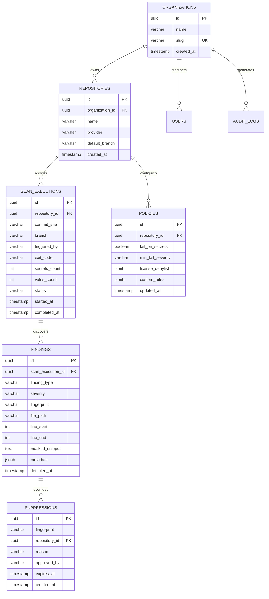

# Technical Requirements Document (TRD)
## Project Name: GateSentry (CI/CD Security Scanner & Policy Enforcement Platform)
**Document Version:** 1.0.0  
**Status:** Approved for Implementation  
**Lead Architect:** Principal Enterprise & Security Solutions Architect  
**Associated PRD:** [GateSentry PRD v1.0.0](./PRD.md)  
**Target Milestone:** MVP Release & Enterprise Baseline  

---

## 1. System Overview & Engineering Scope

GateSentry is an enterprise-grade DevSecOps automation platform and shift-left security enforcement engine. The platform consists of two unified tiers:
1. **The GateSentry Core Scanner (CLI & Runner Agent):** A zero-dependency, ultra-fast, cross-platform static analysis binary deployed into developer workstations (pre-commit) and CI/CD pipelines (GitHub Actions, GitLab CI, Jenkins, Bitbucket). It executes deep secret detection, Software Composition Analysis (SCA), and license verification with deterministic exit codes (`0`, `1`, `2`).
2. **The GateSentry Central Platform (Cloud/SaaS & Self-Hosted):** An orchestration backend and multi-tenant web application that ingests scan telemetry (SARIF/JSON), aggregates vulnerability postures across thousands of repositories, centralizes organizational security policies (`.gatesentry.yml`), manages time-bound remediation waivers, and provides audit trails for compliance frameworks (SOC 2, ISO 27001).

### 1.1 Key System Constraints & Non-Negotiables
- **Execution Overhead:** CI/CD scan step must complete in under 45 seconds ($P_{95}$) for repositories with up to 5,000 files.
- **Data Privacy (Zero-Knowledge Source Code):** No customer proprietary source code leaves the runner. Only metadata, package names, hashes, and redacted finding snippets are transmitted to the backend.
- **Deterministic Build Enforcement:** Non-zero exit codes must be strictly respected by pipeline runners without swallowing errors or intermittent timeouts.
- **Fail-Safe Offline Mode:** In air-gapped or network-restricted environments, the CLI must operate autonomously against local/cached vulnerability snapshots without crashing.

---

## 2. System Architecture & High-Level Design

### 2.1 End-to-End Architecture (C4 Model Level 2)

```
┌─────────────────────────────────────────────────────────────────────────────────────────┐
│                               DEVELOPER & CI RUNNER REALM                                │
│                                                                                         │
│  ┌───────────────────────┐          ┌────────────────────────────────────────────────┐  │
│  │ Developer Workstation │          │   CI/CD Runner (GitHub Actions / GitLab CI)    │  │
│  │ (Local Pre-Commit)    │          │                                                │  │
│  └──────────┬────────────┘          │  ┌──────────────────────────────────────────┐  │  │
│             │                       │  │         GateSentry CLI Engine            │  │  │
│             ▼                       │  │                                          │  │  │
│  ┌───────────────────────┐          │  │  ┌───────────────┐   ┌────────────────┐  │  │  │
│  │  GateSentry CLI Exec  │          │  │  │ Secret Engine │   │   SCA Engine   │  │  │  │
│  │  (Diff Scanner)       │          │  │  │ Shannon/Regex │   │ Lockfile/OSV   │  │  │  │
│  └──────────┬────────────┘          │  │  └───────┬───────┘   └────────┬───────┘  │  │  │
│             │                       │  │          │                    │          │  │  │
│             │ Block Commit if Leak  │  │          ▼                    ▼          │  │  │
│             │                       │  │      ┌───────────────────────────┐       │  │  │
│             ▼                       │  │      │   Local Policy Engine     │       │  │  │
│      [ Local Terminal ]             │  │      │    (.gatesentry.yml)      │       │  │  │
│      ANSI Formatted Report          │  │      └─────────────┬─────────────┘       │  │  │
│                                     │  │                    │                     │  │  │
│                                     │  │      ┌─────────────┴─────────────┐       │  │  │
│                                     │  │      ▼                           ▼       │  │  │
│                                     │  │ [SARIF v2.1.0]            [Exit Code]    │  │  │
│                                     │  │ [JSON Summary]            (0 or 1 or 2)  │  │  │
│                                     │  └──────┬───────────────────────────┼───────┘  │  │
│                                     └─────────┼───────────────────────────┼──────────┘  │
└───────────────────────────────────────────────┼───────────────────────────┼─────────────┘
                                                │ HTTPS / TLS 1.3           │ Exit 1 Breaks Build
                                                │ SARIF & Telemetry Ingest  ▼
                                                │                   [ Pipeline Halted ]
┌───────────────────────────────────────────────┼─────────────────────────────────────────┐
│                                               ▼                                         │
│                                  GATESENTRY PLATFORM (CLOUD / SAAS)                     │
│                                                                                         │
│  ┌───────────────────────────────────────────────────────────────────────────────────┐  │
│  │               API Gateway & Load Balancer (Envoy / AWS ALB / TLS Term)            │  │
│  │           - Rate Limiting, TLS 1.3 Termination, CI Runner Token Auth              │  │
│  └─────────────────────────────────────┬─────────────────────────────────────────────┘  │
│                                        │                                                │
│         ┌──────────────────────────────┴──────────────────────────────┐                 │
│         ▼                                                             ▼                 │
│  ┌───────────────────────────────┐                   ┌───────────────────────────────┐  │
│  │     Backend Core API Service  │                   │      SARIF Ingestion Worker   │  │
│  │     (Go / Gin-Gonic)          │                   │      (Go Async Worker Pool)   │  │
│  │   - Policy Management         │                   │   - Validates JSON/SARIF 2.1  │  │
│  │   - RBAC & Team Auth          │                   │   - Normalizes & Deduplicates │  │
│  │   - Organization & Repos      │                   │   - Computes Blast Radius     │  │
│  └──────────────┬────────────────┘                   └───────────────┬───────────────┘  │
│                 │                                                    │                  │
│                 ├──────────────────────────────┬─────────────────────┘                  │
│                 ▼                              ▼                                        │
│  ┌──────────────────────────────┐    ┌───────────────────────────────────┐              │
│  │ PostgreSQL 16 (Relational)   │    │ Redis 7.2 (Cache & PubSub / Queue)│              │
│  │ - Tenancy, Policies, Users   │    │ - Task Queuing (Asynq)            │              │
│  │ - Scans, Findings, Waivers   │    │ - Session Store, Rate Limiting    │              │
│  └──────────────┬───────────────┘    └───────────────────────────────────┘              │
│                 │                                                                       │
│                 ▼                                                                       │
│  ┌──────────────────────────────┐    ┌───────────────────────────────────┐              │
│  │ S3 / Cloud Object Storage    │    │ Advisory Intelligence Sync Worker │              │
│  │ - Raw Immutable SARIF Files  │    │ - Hourly OSV.dev & NVD Feed Pull  │              │
│  │ - Scan Execution Logs        │    │ - Offline DB Bundle Compiler      │              │
│  └──────────────────────────────┘    └───────────────────────────────────┘              │
│                                                                                         │
│  ┌───────────────────────────────────────────────────────────────────────────────────┐  │
│  │               Web Dashboard UI (Next.js 14 App Router, React, Tailwind)           │  │
│  │   - Executive Security Posture, Repo Matrix, Rule Builder, Finding Triaging       │  │
│  └───────────────────────────────────────────────────────────────────────────────────┘  │
└─────────────────────────────────────────────────────────────────────────────────────────┘
```

### 2.2 Core Component Breakdown

| Subsystem | Primary Function | Deployment Model | Language / Runtime |
| :--- | :--- | :--- | :--- |
| **Scanner CLI Core** | High-performance secret parsing, lockfile extraction, local policy evaluation, SARIF generation. | Static binary (`x86_64`, `arm64`), Docker container, GitHub Action. | **Go 1.22+** (Zero CGO) |
| **Backend Core API** | Tenant management, repository registry, REST/GraphQL endpoints, policy configuration sync. | Containerized microservice in Kubernetes / AWS ECS. | **Go (Gin / Chi)** |
| **Ingestion Worker** | Asynchronously decodes and validates SARIF payloads, fingerprints findings, calculates posture scores. | Event-driven worker pool consuming Redis / SQS. | **Go (Asynq worker engine)** |
| **Vulnerability Sync Worker** | Continuously mirrors OSV (Open Source Vulnerabilities) and GitHub Security Advisories; compiles offline database artifacts. | Scheduled Kubernetes CronJob. | **Go / Python** |
| **Web Dashboard** | Visualization, repo compliance tracking, suppression workflows, developer remediation portal. | Edge-cached Next.js deployment (Vercel or AWS Amplify / CloudFront + Fargate). | **TypeScript / Next.js 14** |

---

## 3. Detailed Technology Stack Specifications

### 3.1 Frontend Stack (Management Dashboard & Portal)
- **Framework:** Next.js 14+ (App Router architecture with React Server Components for fast initial paint and SEO/security header controls).
- **Language:** TypeScript 5.4+ (Strict typing enabled, `noImplicitAny: true`).
- **Styling & UI Library:**
  - Tailwind CSS v3.4+ for responsive utility-first design.
  - Radix UI Primitives (headless, accessible design tokens for dialogs, popovers, dropdowns, accessible tabs).
  - Lucide React for consistent, lightweight DevSecOps iconography.
- **Data Fetching & Client State:**
  - TanStack Query v5 (React Query) for optimistic updates, background refetching, and automated cache invalidation.
  - Zustand for minimal, high-performance client state (filter panels, active drawer states).
- **Data Visualization & Analytics:**
  - Tremor & Recharts for interactive CVE severity distribution charts, MTTR timelines, and compliance gauges.
- **Code & Diff Viewing:**
  - `@monaco-editor/react` (read-only mode) and `diff2html` for displaying masked finding locations and configuration previews.

### 3.2 Backend Stack (Platform API & Ingestion)
- **Runtime & Language:** **Go 1.22+**
  - *Rationale:* Memory safety without runtime GC stalls, sub-millisecond API response times, native concurrency model (goroutines) for processing massive multi-megabyte SARIF files, and unified codebase shared with the CLI scanner.
- **Web Framework / Router:** Gin Web Framework or Chi Router (lightweight, zero reflection overhead).
- **Task Queue / Asynchronous Broker:**
  - Redis 7.2 with `hibiken/asynq` (guaranteed at-least-once task delivery, priority queues, automatic retry with exponential backoff).
- **Data Serialization:**
  - Protobuf / gRPC for internal worker communication.
  - Streaming JSON decoder (`json.Decoder` with buffer pools) to ingest payloads up to 50MB without spiking memory.
- **API Documentation & Contracts:** OpenAPI 3.1 specs auto-generated via `swag` / `gnostic`.

### 3.3 Database & Storage Architecture
- **Primary Relational Store:** **PostgreSQL 16**
  - Relational consistency for tenants, users, repos, policies, and waivers.
  - Native `JSONB` with GIN indexing for flexible vulnerability metadata, advisory payloads, and raw rule configurations.
  - Partitioning: Monthly table partitioning on the `scan_executions` and `findings` tables to guarantee index performance at scale (>100M rows).
- **Fast In-Memory Store & Cache:** **Redis 7.2 (Cluster mode enabled)**
  - Ephemeral token storage and revocation blacklists.
  - API rate-limiting buckets (Token bucket algorithm).
  - Advisory feed lookup cache (reduces DB hits for popular packages like `lodash` or `requests`).
- **Object Storage:** **AWS S3 / Google Cloud Storage / MinIO (S3-compatible)**
  - Stores compressed, immutable raw SARIF artifacts (`.sarif.gz`) and console execution logs for compliance auditing.
  - Object lifecycle rules: Transition to Glacier/Coldline after 90 days; permanent deletion after 365 days (configurable per enterprise policy).

---

## 4. CLI Scanner Engine Architecture (The Runner Core)

The CLI is the critical edge component executed on developer machines and in CI/CD runner environments.

```
┌─────────────────────────────────────────────────────────────────────────────┐
│                           GateSentry CLI Engine                              │
│                                                                             │
│  [CLI Inputs: flags, env vars, target dir]                                  │
│         │                                                                   │
│         ▼                                                                   │
│  ┌───────────────────────┐                                                  │
│  │ Configuration Loader  │ ──► Parses .gatesentry.yml + CLI Flags           │
│  └──────────┬────────────┘                                                  │
│             │                                                               │
│             ├──────────────────────────────┬─────────────────────────────┐  │
│             ▼                              ▼                             ▼  │
│  ┌───────────────────────┐   ┌───────────────────────────┐   ┌───────────┴┐ │
│  │   Git Change Filter   │   │ Lockfile Parser & Walker  │   │ Rule Cache │ │
│  │  - Git Diff Worker    │   │  - package-lock.json      │   │ - Signatures││
│  │  - Staged / Unstaged  │   │  - requirements.txt       │   │ - Entropy  │ │
│  │  - Commit History     │   │  - go.sum, poetry.lock    │   └───────────┬┘ │
│  └──────────┬────────────┘   └─────────────┬─────────────┘               │  │
│             │                              │                             │  │
│             ▼                              ▼                             │  │
│  ┌───────────────────────┐   ┌───────────────────────────┐               │  │
│  │ Secret Scanner Module │   │ Dependency Scanner Module │               │  │
│  │  - Regex Tokenizer    │   │  - Dependency Graph       │               │  │
│  │  - Shannon Entropy    │   │  - OSV Batch Query / Cache│               │  │
│  │  - Allowlist / Ignore │   │  - License Evaluator      │               │  │
│  └──────────┬────────────┘   └─────────────┬─────────────┘               │  │
│             │                              │                             │  │
│             └───────────────────────┬──────┘                             │  │
│                                     ▼                                    │  │
│                      ┌─────────────────────────────┐                     │  │
│                      │   Policy Evaluation Gate    │ ◄───────────────────┘  │
│                      │  - Evaluates Fail Threshold │                        │
│                      │  - Validates Expirations    │                        │
│                      └──────────────┬──────────────┘                        │
│                                     │                                       │
│             ┌───────────────────────┼───────────────────────────┐           │
│             ▼                       ▼                           ▼           │
│  ┌──────────────────────┐  ┌──────────────────┐  ┌───────────────────────┐  │
│  │ Terminal ANSI Formatter│  │  SARIF v2.1.0    │  │ Platform Ingest Client│  │
│  │ - Redacted Findings  │  │  Output Writer   │  │ (Async HTTP Upload)   │  │
│  │ - Fix Recommendations│  └──────────────────┘  └───────────────────────┘  │
│  └──────────┬───────────┘                                                   │
│             │                                                               │
│             ▼                                                               │
│    [ Exit Code Determination: 0 (Pass), 1 (Violation), 2 (System Error) ]   │
└─────────────────────────────────────────────────────────────────────────────┘
```

### 4.1 Secret Detection Algorithm & Shannon Entropy Calculation
To achieve $<3\%$ false-positive rates, GateSentry implements a **Two-Tier Detection Pipeline**:

1. **Tier 1: High-Speed Regex Signatures (Pre-Filter)**
   Compiled regexes run across file streams. Examples:
   - AWS Access Key: `(?i)\b(AKIA|ABIA|ACCA|ASIA)[0-9A-Z]{16}\b`
   - GitHub Personal Access Token (Classic & Fine-Grained): `\b(ghp_[a-zA-Z0-9]{36}|github_pat_[a-zA-Z0-9_]{82})\b`
   - Slack Webhook: `https:\/\/hooks\.slack\.com\/services\/T[a-zA-Z0-9_]{8}\/B[a-zA-Z0-9_]{8,12}\/[a-zA-Z0-9_]{24}`
   - Generic Private Keys: `-----BEGIN (RSA|EC|DSA|OPENSSH) PRIVATE KEY-----`
   - Generic API Token heuristics: `(?i)(bearer|api_key|token|secret|password)\s*[:=]\s*['"][a-zA-Z0-9_\-]{20,}['"]`

2. **Tier 2: Shannon Entropy Calculation**
   For generic tokens, calculate Shannon Entropy ($H$):
   $$H(X) = -\sum_{i=1}^{n} P(x_i) \log_2 P(x_i)$$
   - Where $P(x_i)$ is the probability of character $x_i$ appearing in token string $X$.
   - **Threshold:** Strings with length $>20$ characters and $H(X) \ge 4.5$ (for alphanumeric character sets) or $\ge 3.8$ (for Base64/Hex subsets) are flagged.
   - **Exclusion Filters:** Automated exclusion of git commit hashes (40-char hex matching commit logs), UUIDs, mathematical hashes, and file paths.

### 4.2 Dependency & SCA Scanning Engine
- **Lockfile Parser:** Extracts exact pinned versions (avoids loose semver ambiguity).
  - NPM: Parses `packages[""].dependencies` in `package-lock.json` (v2 & v3 format).
  - Python: Parses pinned requirements (`package==1.2.3`) or `poetry.lock` hashes.
  - Go: Parses `go.sum` hashes and module specs.
- **Vulnerability Query Engine:**
  - Batch queries `https://api.osv.dev/v1/querybatch` sending lists of `(package, version, ecosystem)`.
  - Maps response to standard CVSS v3.1 vector, severity strings (`CRITICAL`, `HIGH`, `MEDIUM`, `LOW`), affected ranges, and exact remediation versions.

---

## 5. Database Schema & Data Models

PostgreSQL 16 serves as the primary operational database.



### 5.1 DDL Specifications for Core Tables

```sql
-- Core Organizations Table
CREATE TABLE organizations (
    id UUID PRIMARY KEY DEFAULT gen_random_uuid(),
    name VARCHAR(255) NOT NULL,
    slug VARCHAR(100) UNIQUE NOT NULL,
    settings JSONB DEFAULT '{}'::jsonb,
    created_at TIMESTAMPTZ DEFAULT NOW(),
    updated_at TIMESTAMPTZ DEFAULT NOW()
);

-- Repositories Registry
CREATE TABLE repositories (
    id UUID PRIMARY KEY DEFAULT gen_random_uuid(),
    organization_id UUID NOT NULL REFERENCES organizations(id) ON DELETE CASCADE,
    external_repo_id VARCHAR(255),
    name VARCHAR(255) NOT NULL,
    provider VARCHAR(50) NOT NULL, -- 'github', 'gitlab', 'bitbucket', 'custom'
    default_branch VARCHAR(100) DEFAULT 'main',
    is_active BOOLEAN DEFAULT TRUE,
    created_at TIMESTAMPTZ DEFAULT NOW(),
    CONSTRAINT uq_org_repo UNIQUE (organization_id, name)
);
CREATE INDEX idx_repos_org ON repositories(organization_id);

-- Scan Execution Runs (Partitioned by Month)
CREATE TABLE scan_executions (
    id UUID NOT NULL DEFAULT gen_random_uuid(),
    repository_id UUID NOT NULL REFERENCES repositories(id) ON DELETE CASCADE,
    commit_sha CHAR(40) NOT NULL,
    branch VARCHAR(255) NOT NULL,
    ci_provider VARCHAR(50) NOT NULL, -- 'github-actions', 'gitlab-ci', 'cli'
    triggered_by VARCHAR(255) NOT NULL,
    exit_code SMALLINT NOT NULL, -- 0 = Pass, 1 = Policy Failure, 2 = Runtime Error
    scan_duration_ms INTEGER NOT NULL,
    secrets_count INTEGER DEFAULT 0,
    vulns_count INTEGER DEFAULT 0,
    license_violations_count INTEGER DEFAULT 0,
    sarif_storage_path VARCHAR(512),
    created_at TIMESTAMPTZ NOT NULL DEFAULT NOW(),
    PRIMARY KEY (id, created_at)
) PARTITION BY RANGE (created_at);

-- Findings Table (Stores Normalized Violations)
CREATE TABLE findings (
    id UUID NOT NULL DEFAULT gen_random_uuid(),
    scan_execution_id UUID NOT NULL,
    repository_id UUID NOT NULL REFERENCES repositories(id) ON DELETE CASCADE,
    finding_type VARCHAR(50) NOT NULL, -- 'SECRET', 'CVE', 'LICENSE'
    severity VARCHAR(20) NOT NULL, -- 'CRITICAL', 'HIGH', 'MEDIUM', 'LOW', 'INFO'
    fingerprint CHAR(64) NOT NULL, -- SHA256(rule_id + file_path + normalized_match)
    rule_id VARCHAR(100) NOT NULL,
    file_path VARCHAR(1024) NOT NULL,
    line_start INTEGER,
    line_end INTEGER,
    masked_snippet TEXT,
    is_suppressed BOOLEAN DEFAULT FALSE,
    metadata JSONB DEFAULT '{}'::jsonb, -- Stores CVSS, CVE IDs, Package Name, Fixed Versions
    created_at TIMESTAMPTZ NOT NULL DEFAULT NOW(),
    PRIMARY KEY (id, created_at)
) PARTITION BY RANGE (created_at);

CREATE INDEX idx_findings_repo_fingerprint ON findings(repository_id, fingerprint);
CREATE INDEX idx_findings_severity ON findings(severity);
CREATE INDEX idx_findings_metadata_gin ON findings USING GIN (metadata);

-- Suppressions and Waivers Table
CREATE TABLE suppressions (
    id UUID PRIMARY KEY DEFAULT gen_random_uuid(),
    repository_id UUID NOT NULL REFERENCES repositories(id) ON DELETE CASCADE,
    fingerprint CHAR(64) NOT NULL,
    reason TEXT NOT NULL,
    requested_by VARCHAR(255) NOT NULL,
    approved_by VARCHAR(255) NOT NULL,
    expires_at TIMESTAMPTZ NOT NULL,
    created_at TIMESTAMPTZ DEFAULT NOW(),
    CONSTRAINT uq_repo_fingerprint UNIQUE (repository_id, fingerprint)
);
```

---

## 6. Authentication & Authorization (IAM)

GateSentry enforces zero-trust access control across two distinct communication domains: User Dashboard Access and CI/CD Machine Ingestion.

```
┌─────────────────────────────────────────────────────────────────────────────┐
│                            AUTHENTICATION TIERS                             │
├──────────────────────────────────────┬──────────────────────────────────────┤
│  DOMAIN 1: HUMAN / DASHBOARD USERS   │   DOMAIN 2: CI/CD RUNNER (MACHINE)   │
├──────────────────────────────────────┼──────────────────────────────────────┤
│  - OAuth 2.0 / OIDC Identity Provider│  - Ephemeral CI Tokens / Scoped Keys │
│  - GitHub, GitLab, Google Workspace  │  - Format: `gs_run_live_<random_64>` │
│  - Short-lived JWT (15-min expiry)   │  - Validated against Repo Secret Org │
│  - HTTP-Only, Secure, SameSite Cookie│  - Signed Request Payload HMAC-SHA256│
│  - Refresh Token stored in Redis     │  - Rate-Limited & IP-Restricted      │
└──────────────────────────────────────┴──────────────────────────────────────┘
```

### 6.1 Role-Based Access Control (RBAC) Matrix

| Permission / Action | Super Admin | AppSec / Security Engineer | DevOps / Platform Lead | Developer |
| :--- | :---: | :---: | :---: | :---: |
| **Manage Org Billing & Global SSO** | ✅ | ❌ | ❌ | ❌ |
| **Define Global Security Policies** | ✅ | ✅ | ❌ | ❌ |
| **Approve Policy Waivers / Suppressions**| ✅ | ✅ | ❌ | ❌ |
| **Manage CI Tokens & Repository Links**| ✅ | ✅ | ✅ | ❌ |
| **Trigger Scans & View Reports** | ✅ | ✅ | ✅ | ✅ |
| **View Raw Redacted Code Snippets** | ✅ | ✅ | ✅ | ✅ |

### 6.2 CI Runner Token Security & Ingestion Flow
1. DevOps generates a scoped runner token in the dashboard: `gs_live_9f83a...` (hashed using SHA-256 before DB persistence).
2. The CI pipeline references this token via repository secret (`GATESENTRY_TOKEN`).
3. During execution, the CLI crafts an ingestion HTTP POST with header:
   `Authorization: Bearer gs_live_9f83a...`
4. The API gateway verifies the token hash against Redis cache in $<2$ ms; rejects invalid or revoked tokens with `401 Unauthorized`.

---

## 7. API Architecture & Interface Contracts

The platform exposes a standard RESTful HTTP API with JSON payloads over TLS 1.3.

### 7.1 Core Endpoint Specifications

#### 1. Ingest Scan Telemetry & SARIF Report
- **Route:** `POST /api/v1/scans/ingest`
- **Headers:** 
  - `Authorization: Bearer <gs_live_...>`
  - `Content-Type: multipart/form-data` or `application/json`
- **Request Body (Multipart or JSON):**
  ```json
  {
    "repository_name": "acme/payment-gateway",
    "commit_sha": "a1b2c3d4e5f60718293a4b5c6d7e8f9012345678",
    "branch": "feature/checkout-v2",
    "ci_provider": "github-actions",
    "scanner_version": "1.0.0",
    "exit_code": 1,
    "scan_duration_ms": 4250,
    "metrics": {
      "secrets_detected": 1,
      "vulnerabilities_detected": 3,
      "licenses_flagged": 0
    },
    "sarif_report": { ... }
  }
  ```
- **Response (`202 Accepted`):**
  ```json
  {
    "status": "QUEUED",
    "scan_id": "8bfa2e41-60d9-4f71-a068-07e9a8f4c719",
    "message": "SARIF payload queued for asynchronous analysis and fingerprinting."
  }
  ```

#### 2. Fetch Active Policy for Repository
- **Route:** `GET /api/v1/policies/evaluate?repo=acme/payment-gateway`
- **Description:** Allows CI runner to fetch centralized enterprise policy when local `.gatesentry.yml` is absent.
- **Response (`200 OK`):**
  ```json
  {
    "version": "1",
    "fail_on": {
      "secrets": true,
      "vulnerability_severity": "HIGH",
      "cvss_threshold": 7.0,
      "licenses": ["AGPL-3.0", "GPL-3.0"]
    },
    "active_suppressions": [
      {
        "fingerprint": "e3b0c44298fc1c149afbf4c8996fb92427ae41e4649b934ca495991b7852b855",
        "advisory_id": "GHSA-xxxx-xxxx-xxxx",
        "expires_at": "2026-10-01T00:00:00Z",
        "reason": "Upstream patch scheduled in next sprint"
      }
    ]
  }
  ```

#### 3. Request Finding Suppression (Waiver Workflow)
- **Route:** `POST /api/v1/suppressions`
- **Request Body:**
  ```json
  {
    "repository_id": "e4a2c1b8-7b9c-4f81-9b67-4f8a29b0a112",
    "fingerprint": "c782b5f63...8912",
    "reason": "Test fixture key with mock data only. Never used in production.",
    "valid_days": 30
  }
  ```
- **Response (`201 Created`):**
  ```json
  {
    "suppression_id": "99c1e7a4-301d-400a-bcf8-04f81b4d0812",
    "status": "APPROVED",
    "expires_at": "2026-10-15T21:11:33Z"
  }
  ```

---

## 8. Security Requirements & Compliance Guardrails

```
┌─────────────────────────────────────────────────────────────────────────────┐
│                       DATA FLOW & MASKING SANITIZATION                      │
│                                                                             │
│  Raw Code Line in File:                                                     │
│  AWS_SECRET_ACCESS_KEY="wJalrXUtnFEMI/K7MDENG/bPxRfiCYEXAMPLEKEY"           │
│                            │                                                │
│                            ▼ [Scanner Sanitization Filter]                  │
│  Redacted Log / SARIF:                                                      │
│  AWS_SECRET_ACCESS_KEY="wJal*********************************"             │
│                            │                                                │
│                            ▼                                                │
│  [Terminal ANSI Output]           [SARIF Output]         [Cloud Ingestion]  │
│  Never displays raw key           Never contains key     Zero raw data sent │
└─────────────────────────────────────────────────────────────────────────────┘
```

1. **Token Masking & Non-Disclosure Guarantee:**
   - Secrets are masked immediately upon detection in memory.
   - For any detected secret: Reveal first 4 characters, mask remaining characters with `*`, preserve total length.
   - Raw credentials are never serialized to stdout, stderr, JSON, SARIF, or network requests.
2. **Zero Source Code Exfiltration:**
   - The CLI scanner operates strictly as an edge compute agent.
   - No lines of code outside the single-line masked snippet are ever transmitted over the network.
   - SCA scans transmit only package names and pinned version strings to the OSV API.
3. **Air-Gapped & Resilient Operation:**
   - The CLI includes an embedded offline vulnerability database snapshot compiled into binary releases.
   - If the network call to `api.osv.dev` fails or times out ($>3000\text{ms}$), the scanner falls back to the embedded snapshot and outputs a warning without failing the build with exit code 2.
4. **Data at Rest & in Transit:**
   - TLS 1.3 enforced on all API routes with strict HSTS headers.
   - Database tables encrypted using AWS KMS managed AES-256 keys.
   - S3 raw SARIF buckets configured with Object Lock (WORM compliance) for tamper-proof audit trails.

---

## 9. Deployment, Distribution & Infrastructure Plan

### 9.1 Multi-Platform CLI Packaging & Distribution

```
                    ┌───────────────────────────────┐
                    │  Go Releaser Build Pipeline   │
                    └───────────────┬───────────────┘
                                    │
       ┌────────────────────────────┼────────────────────────────┐
       ▼                            ▼                            ▼
┌──────────────┐             ┌──────────────┐             ┌──────────────┐
│ Static Binary│             │ Docker Image │             │ GitHub Action│
│ (Linux/macOS/│             │ (Alpine/Scr.)│             │ (action.yml) │
│  Windows)    │             │              │             │              │
└──────┬───────┘             └──────┬───────┘             └──────┬───────┘
       │                            │                            │
       ▼                            ▼                            ▼
[GitHub Releases]            [Docker Hub &]               [GitHub Market-]
[Homebrew Tap / Curl]        [GitHub GHCR]                [place Release ]
```

- **Zero-CGO Static Compilations:**
  - `gatesentry-linux-amd64`
  - `gatesentry-linux-arm64`
  - `gatesentry-darwin-amd64`
  - `gatesentry-darwin-arm64`
  - `gatesentry-windows-amd64.exe`
- **Container Registry:** `ghcr.io/gatesentry/scanner:latest` (Distroless / Scratch base image, total image size $<25\text{MB}$).
- **GitHub Action (`action.yml`):** Ready-to-use composite/docker action configured with single-step inclusion:
  ```yaml
  - name: Run GateSentry Security Scan
    uses: gatesentry/action@v1
    with:
      token: ${{ secrets.GATESENTRY_TOKEN }}
      fail-on: "high"
  ```

### 9.2 Central Platform Cloud Infrastructure (Terraform / Kubernetes)
- **Compute:** AWS EKS (Elastic Kubernetes Service) with Karpenter autoscaling node groups.
  - API pods autoscale on CPU $>70\%$ and request latency $>150\text{ms}$.
  - Worker pods scale based on Redis queue depth (`asynq` queue size).
- **Ingress:** AWS Application Load Balancer (ALB) with AWS WAF rules enabled (blocking SQLi, automated scanners, rate-limiting IPs).
- **Database:** Amazon Aurora Serverless v2 PostgreSQL (Multi-AZ with read replica).

---

## 10. Technical Decisions & Trade-Off Analysis

| Architectural Decision | Options Considered | Selected Choice | In-Depth Rationale & Trade-Offs |
| :--- | :--- | :--- | :--- |
| **1. CLI Engine Language** | • Go<br>• Rust<br>• Python<br>• Node.js | **Go (Golang 1.22)** | **Why:** Go compiles to a single, zero-dependency static binary that runs instantly on any minimal Linux CI container without requiring Python runtimes, Node engines, or shared C libraries. Rust offers marginally higher memory efficiency, but Go provides superior regex execution performance, an ultra-fast cross-compilation pipeline, and drastically faster team development velocity. Python/Node were rejected due to the cold-start runtime overhead (2-5s startup latency) and environment dependency hell. |
| **2. Vulnerability Feed Aggregation** | • Direct NVD API<br>• OSV.dev API<br>• Commercial Feeds (Snyk/Sonatype) | **OSV.dev + Offline Cache** | **Why:** The National Vulnerability Database (NVD) API enforces severe rate limits and lacks precise package-level ecosystem mapping for modern git ecosystems. Google's Open Source Vulnerabilities (OSV.dev) standardizes schemas across npm, PyPI, Go, Maven, and Rust with high-throughput batch query endpoints. We complement this with our own worker cache for zero-latency lookups. |
| **3. Output Data Standardization** | • Custom JSON<br>• OASIS SARIF v2.1.0<br>• SonarQube Generic | **OASIS SARIF v2.1.0 + ANSI Stdout** | **Why:** SARIF (Static Analysis Results Interchange Format) is the gold standard for security tooling interoperability. By producing SARIF v2.1.0 natively, GateSentry findings render automatically inside the native GitHub Code Scanning UI and GitLab Security Dashboards without custom plugins. ANSI text is retained for clean terminal logs. |
| **4. Backend Architecture** | • Distributed Microservices<br>• Modular Monolith in Go<br>• Serverless Lambdas | **Modular Monolith in Go** | **Why:** At MVP and early enterprise stage, microservices introduce distributed tracing complexity, network hop latency, and complex deployment coordination. A modular monolith cleanly separating HTTP API, Ingestion Worker, and Rule Evaluator packages inside a single Go repository allows shared domain types with the CLI while running distinct worker processes in production containers. |
| **5. Database & Metadata Engine** | • PostgreSQL 16<br>• MongoDB<br>• DynamoDB | **PostgreSQL 16 (Relational + JSONB)** | **Why:** The domain requires strict relational integrity (tenants $\to$ repos $\to$ scans $\to$ findings) and ACID transactional guarantees for suppression waivers. At the same time, CVE payloads and advisory schemas vary wildly across ecosystems. Postgres provides the best of both worlds: relational consistency with high-performance `JSONB` and GIN indexing for polymorphic vulnerability data. |
| **6. Frontend Dashboard Architecture** | • Next.js 14 App Router<br>• Single Page App (Vite + React)<br>• Remix | **Next.js 14 (App Router)** | **Why:** Hybrid rendering allows instantaneous dashboard loads via Server Components for static layouts and security posture views, while client components handle interactive triage drawers, filters, and charts. Native API route handlers enable simplified BFF (Backend-For-Frontend) token exchanges. |
| **7. Secret Detection Technique** | • Pure Regex Pattern Matching<br>• Shannon Entropy Only<br>• Hybrid Regex + Entropy Pipeline | **Two-Tier Hybrid (Regex + Shannon Entropy)** | **Why:** Pure regex misses unknown/custom private tokens. Pure entropy produces massive false-positive rates on commit hashes, UUIDs, and base64 assets. The two-tier hybrid model runs regex first for high-confidence provider tokens, and triggers Shannon entropy scoring with contextual heuristics only on variable assignments and credentials fields. |

---

## 11. Verification, Testing & QA Strategy

To ensure reliability in production pipelines, GateSentry enforces a 4-layer testing pyramid:

1. **Unit & Signature Benchmark Tests (`go test ./...`):**
   - Unit tests covering Shannon entropy calculation, lockfile parsers (v1, v2, v3 npm, requirements, poetry, go.sum).
   - Validation against the **OWASP Secret Benchmark** test suite (100% detection rate target on known secrets).
2. **False-Positive Regression Suite:**
   - Automated scan against 50 prominent open-source repositories (e.g., Kubernetes, React, Django).
   - Enforce assertion: Total false-positive secret count must remain $<3\%$ of total flagged items.
3. **End-to-End CI Pipeline Integration Tests:**
   - GitHub Actions workflow running mock pipeline scenarios:
     - `test_clean_repo`: Expects `exit code 0`.
     - `test_leaked_aws_key`: Expects `exit code 1` + masked output in logs.
     - `test_high_cve_package`: Expects `exit code 1` + SARIF artifact generated.
     - `test_suppressed_cve`: Expects `exit code 0` due to valid waiver.
4. **Load & Stress Testing:**
   - Ingest pipeline benchmarked with `k6` simulating 500 concurrent CI runners uploading 5MB SARIF payloads.
   - Requirement: $P_{99}$ ingestion response latency $<200\text{ms}$.

---
